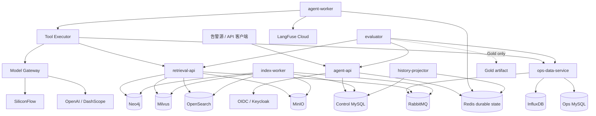
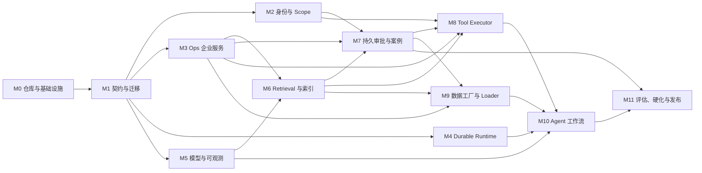

# 能源设备运维诊断 Agent
## Codex 从零开发执行规范（真实服务、逐模块生产门禁版）

> 文档状态：**本项目唯一可修改的开发执行规范**  
> 目标读者：Codex 主执行 Agent、Codex 并行工作 Agent、代码审查 Agent、测试与运维人员  
> 版本：1.0  
> 日期：2026-07-14  
> 工程口径：**绿地建设、后端优先、真实服务、无运行时 Mock、逐模块真实服务门禁、最终可部署生产**

---

## 0. Codex 开始前必须遵守的规则

### 0.1 不可修改的需求源

Codex 必须将以下文件复制到仓库 `docs/immutable/`，保持原始内容不变：

```text
能源设备运维诊断Agent_详细设计.md
```

当前上传文件的 SHA-256 为：

```text
c559a530387de5fc1afced506e406967e74c18ed76e659b4b062c2051b615a11
```

必须实现：

```text
scripts/verify_immutable_design.py
```

并在本地、CI、镜像构建前运行。只要详细设计文件缺失或 SHA-256 改变，流水线立即失败。

详细设计是业务功能、质量要求、状态机、RAG、Tool、记忆、接口、安全和评估要求的不可变来源。本开发规范可以修改，但只能补充实现选择、测试方法和工程边界，不能删除、弱化或绕过详细设计的要求。

旧核对清单中的代码路径、迁移编号、历史实现状态和“已完成”记录不作为本绿地工程的代码基础；其中揭示的并发、数据泄漏、索引一致性、审批、自审、SSE、成本审计和真实服务验收风险，已被吸收到本规范。

### 0.2 裁决优先级

冲突按以下顺序处理：

1. 用户最新明确指令；
2. 不可修改的详细设计；
3. 本开发执行规范；
4. ADR、模块说明、测试说明和代码注释。

本规范不得通过“实现更简单”为理由降低详细设计要求。详细设计未定义的实现细节，优先选择更安全、更可追溯、更易恢复的方案，并记录 ADR。

### 0.3 禁止项

以下行为一律禁止：

1. 在 `full`、`staging`、`production` 或任何 `RUN_LIVE_*` 验收中使用 Mock Provider、fixture adapter、内存仓储或进程内伪服务。
2. 让运行时 Agent 直接读取 `external_systems` JSON、Gold、测试 fixture 或生成器输出文件。
3. 使用 `asyncio.create_task`、线程后台任务或 API 进程内队列作为诊断请求的可靠接受机制。
4. 仅凭健康检查、启动成功、单元测试、跳过测试或手工截图声明模块完成。
5. 在一次请求失败后自动切换模型供应商。
6. 自动执行停机、断电、切换回路、工单写入、案例批准等高风险写操作。
7. 申请人审批自己的申请，包括管理员。
8. 把未审核案例、弱工单、图谱关系或模型常识当作已确认根因。
9. 将密钥写入 Git、文档、日志、异常信息、测试快照、镜像层或数据集。
10. 在未通过本模块真实服务门禁前开始依赖该模块的下一模块。

### 0.4 “真实服务”的定义

本规范中的真实服务必须同时满足：

- 独立进程或容器；
- 通过真实网络协议调用；
- 有鉴权；
- 有持久化存储；
- 有迁移、事务或明确的一致性协议；
- 有健康与 readiness；
- 有超时、错误码、幂等和审计；
- 测试后可从最终存储回读副作用；
- 可由生产部署清单启动；
- 不是为了让测试通过而返回固定结果的程序。

项目自建的 `ops-data-service` 是试点企业系统的真实服务实现，不是 Mock。它用 MySQL、InfluxDB、RabbitMQ 和真实身份验证承载 CMDB、SCADA、CMMS 与告警接入。未来替换为外部企业系统时，仅替换 Provider/Adapter，不改变 Agent、Tool Schema、状态机或公共 API。

项目生成的数据属于**生产形态、物理一致、持久化可回读的合成数据**。它不是实际企业现场数据，不得对外声称代表真实设备准确率；但它不是运行时 Mock，也不能被应用直接读取。

---

# 1. 最终交付目标

Codex 最终必须交付一套可部署、可恢复、可审计的能源设备运维诊断 Agent 后端服务，具备：

1. 告警和人工消息两种入口；
2. Redis durable accept、持久 job、lease、fencing、故障恢复；
3. LangGraph 显式诊断工作流；
4. 设备、告警、时序、手册、工单、图谱八类 Tool 能力；
5. OpenSearch + Milvus 混合检索、BGE-M3 embedding、BGE reranker；
6. OpenAI `gpt-4o-mini` 主生成服务，或启动前人工切换到 DashScope `qwen-plus`；
7. 带引用候选根因、排查顺序、安全提示和人工确认；
8. 两阶段持久审批、禁止自审、一次性确认令牌；
9. 审核案例的 MySQL 主库、Milvus 强召回和 Neo4j 降级补偿；
10. 公共 SSE 六种事件、断线回放、慢订阅隔离；
11. LangFuse Cloud trace、Prometheus 指标和真实模型成本台账；
12. 数据生成、验证、装载、真实服务回读与离线评估；
13. Docker Compose 全栈环境和 Kubernetes Helm 生产部署；
14. 每个模块的真实服务门禁报告；
15. 全项目无 Mock 的最终真实服务验收。

本轮不交付 Web 前端。必须交付稳定 OpenAPI、SSE 协议和可供前端接入的鉴权接口。

---

# 2. 一期范围与非目标

## 2.1 必须实现

- 储能、光伏、风电及相关能源设备的告警辅助诊断；
- 设备信息、告警事实、时序窗口、手册、历史工单、图谱关系联合取证；
- 2–4 个候选根因；
- 每个候选根因的支持证据、反证、缺失信息和人工确认标志；
- 诊断摘要、排查步骤、安全提示、工单建议；
- 低证据、高风险、冲突证据和现场不可判断时进入人工协同；
- 工单与案例审核闭环；
- 可恢复、可追踪、可评估。

## 2.2 明确非目标

- 无人值守自动处置；
- 自动停机、断电、切换回路；
- 未审核知识自动成为强证据；
- 全设备、全故障、零配置跨企业迁移；
- 图像、热成像等多模态诊断；
- Web 管理后台；
- 请求级模型自动 fallback；
- 将合成数据包装成实际企业数据。

---

# 3. 固定技术栈

## 3.1 应用

| 类别 | 选择 |
|---|---|
| 语言 | Python 3.12 |
| API | FastAPI |
| 数据模型 | Pydantic v2，所有跨边界对象 `extra="forbid"` |
| Agent | LangGraph |
| HTTP 客户端 | HTTPX AsyncClient，应用生命周期复用 |
| MySQL | SQLAlchemy 2 Core/Async + Alembic；业务事务显式编写 |
| Redis | redis-py asyncio + Lua |
| RabbitMQ | aio-pika，publisher confirm、manual ack |
| InfluxDB | 官方 Python client |
| OpenSearch | opensearch-py |
| Milvus | pymilvus |
| Neo4j | 官方异步驱动 |
| 包管理 | `uv`，提交 `uv.lock` |
| 静态检查 | Ruff、Mypy |
| 测试 | Pytest、Hypothesis、真实服务 live tests |
| 性能 | Locust |
| 故障注入 | Toxiproxy + 容器终止/网络策略 |
| 容器 | Docker/BuildKit，多阶段构建 |
| 生产部署 | Kubernetes + Helm |

基础服务镜像不能使用 `latest`。Codex 在 M0 中选择稳定版本并写入 `deploy/versions.env`，所有镜像按 digest 固定。升级必须单独 ADR 和真实服务回归。

## 3.2 外部服务白名单

| 用途 | Provider / Model | Endpoint | 密钥变量 |
|---|---|---|---|
| 主生成 | `openai/gpt-4o-mini` | `https://api.openai.com/v1/chat/completions` | `OPENAI_API_KEY` |
| 人工配置切换 | `aliyun/qwen-plus` | `https://dashscope.aliyuncs.com/compatible-mode/v1/chat/completions` | `DASHSCOPE_API_KEY` |
| Embedding | `siliconflow/BAAI/bge-m3` | `https://api.siliconflow.cn/v1/embeddings` | `SILICONFLOW_API_KEY` |
| Reranker | `siliconflow/BAAI/bge-reranker-v2-m3` | `https://api.siliconflow.cn/v1/rerank` | `SILICONFLOW_API_KEY` |
| Trace | `langfuse/cloud` | `https://cloud.langfuse.com` | `LANGFUSE_PUBLIC_KEY`、`LANGFUSE_SECRET_KEY` |

同一进程只启用一个生成 tuple。`full/staging/production/live` 启动时逐字段校验白名单、endpoint 和非占位密钥；不满足即拒绝启动。

---

# 4. 仓库结构

Codex 必须使用以下绿地结构，不复制旧项目路径：

```text
.
├── AGENTS.md
├── pyproject.toml
├── uv.lock
├── Makefile
├── README.md
├── src/energy_agent/
│   ├── api/
│   │   ├── diagnosis.py
│   │   ├── approvals.py
│   │   ├── cases.py
│   │   ├── internal_tools.py
│   │   ├── auth.py
│   │   ├── health.py
│   │   └── errors.py
│   ├── contracts/
│   │   ├── common.py
│   │   ├── canonical.py
│   │   ├── diagnosis.py
│   │   ├── events.py
│   │   ├── tools.py
│   │   ├── approvals.py
│   │   ├── cases.py
│   │   ├── index.py
│   │   └── enterprise.py
│   ├── core/
│   │   ├── config.py
│   │   ├── ids.py
│   │   ├── time.py
│   │   ├── errors.py
│   │   ├── lifecycle.py
│   │   └── security.py
│   ├── auth/
│   │   ├── oidc.py
│   │   ├── scopes.py
│   │   └── actor_assertion.py
│   ├── runtime/
│   │   ├── accept.py
│   │   ├── claim.py
│   │   ├── lease.py
│   │   ├── fencing.py
│   │   ├── events.py
│   │   ├── history_outbox.py
│   │   └── drain.py
│   ├── agent/
│   │   ├── graph.py
│   │   ├── state.py
│   │   ├── nodes/
│   │   ├── templates/
│   │   ├── guardrails.py
│   │   └── service.py
│   ├── tools/
│   │   ├── registry.py
│   │   ├── executor.py
│   │   ├── policies.py
│   │   └── implementations/
│   ├── providers/
│   │   ├── ops_data.py
│   │   ├── retrieval.py
│   │   ├── model.py
│   │   └── identity.py
│   ├── retrieval/
│   │   ├── chunking.py
│   │   ├── ingestion.py
│   │   ├── indexing.py
│   │   ├── release.py
│   │   ├── query_rewrite.py
│   │   ├── hybrid_search.py
│   │   ├── rerank.py
│   │   ├── evidence.py
│   │   └── graph.py
│   ├── memory/
│   │   ├── approvals.py
│   │   ├── cases.py
│   │   ├── case_index.py
│   │   └── reviews.py
│   ├── model/
│   │   ├── gateway.py
│   │   ├── governance.py
│   │   ├── ledger.py
│   │   ├── schemas.py
│   │   └── prompts/
│   ├── persistence/
│   │   ├── control_db.py
│   │   ├── ops_db.py
│   │   ├── redis.py
│   │   ├── influx.py
│   │   ├── rabbit.py
│   │   ├── minio.py
│   │   ├── opensearch.py
│   │   ├── milvus.py
│   │   └── neo4j.py
│   ├── observability/
│   │   ├── tracing.py
│   │   ├── langfuse.py
│   │   ├── metrics.py
│   │   ├── redaction.py
│   │   └── trace_outbox.py
│   └── services/
│       ├── agent_api.py
│       ├── agent_worker.py
│       ├── ops_data_api.py
│       ├── retrieval_api.py
│       ├── index_worker.py
│       ├── history_projector.py
│       └── trace_exporter.py
├── migrations/
│   ├── control/
│   └── ops/
├── data_factory/
│   ├── scenarios/
│   ├── generator/
│   ├── validator/
│   ├── loader/
│   └── evaluator_assets/
├── tests/
│   ├── unit/
│   ├── contract/
│   ├── integration/
│   ├── live/
│   ├── chaos/
│   ├── performance/
│   └── packaging/
├── deploy/
│   ├── compose/
│   ├── helm/
│   ├── keycloak/
│   ├── dashboards/
│   └── versions.env
├── scripts/
├── docs/
│   ├── immutable/
│   ├── adr/
│   ├── gates/
│   ├── runbooks/
│   └── api/
└── artifacts/                 # gitignored
```

`AGENTS.md` 只保留本规范的执行摘要和不可变规则；本文件是完整权威开发文档。

---

# 5. 服务拓扑



物理部署进程：

1. `agent-api`：接入、鉴权、原子接受、查询、SSE。
2. `agent-worker`：领取 durable run，执行 LangGraph。
3. `ops-data-service`：试点企业 CMDB/SCADA/CMMS 边界。
4. `retrieval-api`：文档接入、检索、release 控制面。
5. `index-worker`：RabbitMQ 索引消费、重试、DLQ。
6. `history-projector`：Redis history outbox 到 MySQL。
7. `trace-exporter`：MySQL trace outbox 到 LangFuse。
8. `evaluator`：独立镜像，唯一允许读取 Gold 的进程。

---

# 6. 跨域基础契约

## 6.1 标识与时间

- 所有新业务 ID 使用 UUIDv7，字符串小写标准形式。
- 外部系统 ID 保留原值，但必须同时保存 `source_system` 和 `source_version`。
- 所有时间在边界使用 ISO8601 UTC，固定六位微秒和 `Z`。
- MySQL 使用 `DATETIME(6)`，数据库会话时区固定 UTC。
- InfluxDB 使用 UTC 纳秒时间。
- 禁止以本地时区字符串参与 hash、幂等或排序。

## 6.2 Canonicalization v2

幂等、receipt、Prompt、索引、结果和结算 hash 全部使用同一规范：

1. UTF-8 紧凑 JSON；
2. 对象键按 Unicode code point 排序；
3. 字符串 NFC；
4. 显式保留 `null`；
5. 数组保序；
6. Decimal 禁止指数格式；
7. `-0` 规范为 `0`；
8. 时间统一 UTC 六位微秒 `Z`；
9. 不允许 NaN/Infinity；
10. 每个持久 hash 同时保存 `canonicalization_version=2` 和 SHA-256。

请求指纹排除 Authorization、trace header、传输重试计数等 transport 字段，但包含全部业务字段。

## 6.3 状态枚举

```text
RunStatus:
ACCEPTED | RUNNING | COMPLETED | NEED_USER_INPUT | FAILED

DiagnosisPhase:
INIT | PLAN_READY | DATA_FETCHING | EVIDENCE_READY |
NEED_USER_INPUT | DRAFT_READY | REVIEWING | COMPLETED | FAILED

AlarmDiagnosisStatus:
PENDING | PROCESSING | DISPATCHED | RUNNING |
COMPLETED | AWAITING_HUMAN | FAILED

ToolStatus:
OK | PARTIAL_SUCCESS | NOT_FOUND | TIMEOUT | DEGRADED | FAILED

ApprovalState:
PENDING | APPROVED | REJECTED | CANCELLED

CaseStatus:
DRAFT | PENDING_REVIEW | APPROVED | REJECTED |
DISABLED | SUPERSEDED

IndexState:
PENDING | QUEUED | INDEXED | DEGRADED | FAILED | TOMBSTONED
```

`RunStatus` 和 `DiagnosisPhase` 必须是两个枚举。非终态 Phase 不改变 Run 的 `RUNNING`。`NEED_USER_INPUT` 是本 run 终态；用户回答创建新的 run。

## 6.4 ToolResult

所有 Tool 统一返回：

```json
{
  "status": "OK",
  "success": true,
  "data": {},
  "meta": {
    "trace_id": "uuid",
    "source_system": "ops-data",
    "provider_type": "real",
    "partial_result": false,
    "latency_ms": 128,
    "attempts": 1,
    "retryable": false,
    "retry_after_seconds": null
  },
  "error": null,
  "warnings": []
}
```

失败：

```json
{
  "status": "TIMEOUT",
  "success": false,
  "data": null,
  "meta": {
    "trace_id": "uuid",
    "source_system": "influxdb",
    "provider_type": "real",
    "partial_result": false,
    "latency_ms": 8001,
    "attempts": 2,
    "retryable": true,
    "retry_after_seconds": 2
  },
  "error": {
    "code": "TIMESERIES_TIMEOUT",
    "message": "timeseries dependency timed out",
    "details": {}
  },
  "warnings": []
}
```

读取边界可以把旧 `SUCCESS` 映射为 `OK`，新写入不得产生 `SUCCESS`。

## 6.5 HTTP 错误信封

```json
{
  "error": {
    "code": "SESSION_RUN_IN_PROGRESS",
    "message": "the session already has an active run",
    "retryable": true,
    "retry_after_seconds": 3,
    "details": {
      "active_run_id": "..."
    }
  },
  "trace_id": "...",
  "acceptance_run_id": null
}
```

映射：

| HTTP | 语义 |
|---:|---|
| 401 | 未认证 |
| 403 | 角色或 scope 不允许 |
| 404 | 资源或 Tool NOT_FOUND |
| 409 | 幂等冲突、并发冲突、状态冲突 |
| 422 | Schema 或业务参数非法 |
| 429 | 限流 |
| 500 | 未归类内部错误 |
| 503 | 依赖不可用或无数据 DEGRADED |
| 504 | 上游 TIMEOUT |

只有 429、明确 timeout 和明确 transient 5xx 可重试。写 Tool 不自动重试。

## 6.6 事件信封

内部 RabbitMQ 和持久 outbox 统一使用：

```json
{
  "event_id": "uuidv7",
  "event_type": "manual.index.requested",
  "event_version": 1,
  "occurred_at": "2026-07-14T09:00:00.000000Z",
  "tenant_id": "pilot",
  "trace_id": "uuid",
  "acceptance_run_id": "uuid",
  "aggregate_type": "manual_document",
  "aggregate_id": "uuid",
  "revision": 1,
  "idempotency_key": "stable-event-key",
  "payload": {}
}
```

RabbitMQ topics：

```text
alarm.diagnosis.requested
manual.index.requested
ticket.index.requested
case.approved
case.superseded
expert_template.index.requested
```

每个 topic 有 `.retry`、`.dlq` 和 `.quarantine`。消费者结果只有：

```text
success | retry | dlq | quarantine
```

向 retry、DLQ 或 quarantine 转投必须 publisher-confirm 成功后才 ack 原消息。

---

# 7. 公共 API 与 SSE

## 7.1 会话与运行

### 创建空会话

```http
POST /api/v1/diagnosis/sessions
```

成功 `201`。只创建没有 active run 的会话。

### 接受消息

```http
POST /api/v1/diagnosis/sessions/{session_id}/messages
X-Idempotency-Key: ...
```

成功 `202`，固定响应：

```json
{
  "session_id": "uuid",
  "run_id": "uuid",
  "trace_id": "uuid",
  "acceptance_run_id": "uuid",
  "status": "ACCEPTED",
  "accepted_at": "2026-07-14T09:00:00.000000Z",
  "revision": 2,
  "events_url": "/api/v1/diagnosis/sessions/{session_id}/events",
  "status_url": "/api/v1/diagnosis/runs/{run_id}"
}
```

### 兼容 Chat 入口

```http
POST /api/v1/diagnosis/chat
```

请求体必须含已存在的 `session_id`。与 messages 调用完全相同的原子接受处理器，不允许另建逻辑或双写。

### 告警诊断入口

```http
POST /api/v1/alarm-diagnoses
X-Idempotency-Key: ...
```

首次只返回 durable alarm acceptance 和其状态 URL。告警 outbox 消费后创建/关联 run，状态查询再返回 `run_id`。

### 查询

```text
GET /api/v1/diagnosis/sessions/{session_id}
GET /api/v1/diagnosis/runs/{run_id}
GET /api/v1/diagnosis/sessions/{session_id}/history
```

历史查询必须按 tenant、owner 或授权审核关系过滤，再收窄 site/device scope。

## 7.2 公共 SSE

```http
GET /api/v1/diagnosis/sessions/{session_id}/events
Last-Event-ID: 17
```

公共持久事件只有六种：

```text
intent_identified
data_fetch_started
retrieval_completed
need_user_input
draft_generated
completed
```

Phase 映射固定：

| DiagnosisPhase | 公共事件 |
|---|---|
| `INIT` / `PLAN_READY` | `intent_identified` |
| `DATA_FETCHING` | `data_fetch_started` |
| `EVIDENCE_READY` | `retrieval_completed` |
| `NEED_USER_INPUT` | `need_user_input` |
| `DRAFT_READY` / `REVIEWING` | `draft_generated` |
| `COMPLETED` / `FAILED` | `completed` |

事件 payload：

```json
{
  "event_id": "uuid",
  "sequence": 18,
  "event_type": "retrieval_completed",
  "event_version": 1,
  "session_id": "uuid",
  "run_id": "uuid",
  "trace_id": "uuid",
  "acceptance_run_id": "uuid",
  "phase": "EVIDENCE_READY",
  "occurred_at": "2026-07-14T09:00:03.000000Z",
  "message": "证据检索完成",
  "payload": {}
}
```

要求：

- SSE `id` 为十进制 `sequence`；
- 同 session 从 1 严格递增；
- 先持久化 Redis Stream，再允许客户端读取；
- Redis Stream ID 使用 `{sequence}-0`；
- `Last-Event-ID=N` 只返回 `sequence > N`；
- N 早于保留窗口时发送一次非持久控制帧 `stream.reset_required`，随后关闭；
- heartbeat 是注释帧，不持久化、不占 sequence；
- 每订阅者有界缓冲，发送超时或缓冲满只断开该订阅者；
- API 副本直接从 Redis Stream `XREAD`，不依赖进程内 fanout，也不要求粘性会话。

内部 `run.accepted`、`run.started`、`diagnosis.failed` 只能进入 audit/trace，不进入公共 SSE。失败使用 `completed` 事件，payload 中带 `status=FAILED` 和结构化 error。

Redis 事件保留策略：

- 活跃会话至少保留 24 小时；
- 完成会话至少保留 72 小时；
- 每个 session 默认最多 1,000 个持久事件；
- 只有 MySQL history 已投影到对应 high-watermark 后才允许 trim；
- session 中持久化 `first_retained_sequence` 和 `event_high_watermark`；
- 高风险或待审核会话可延长到 7 天。

## 7.3 审批、Review 与案例 API

```text
POST /api/v1/approvals
GET  /api/v1/approvals/{approval_id}
POST /api/v1/approvals/{approval_id}/decisions

POST /api/v1/diagnosis/sessions/{session_id}/review
POST /api/v1/diagnosis/sessions/{session_id}/case-drafts

GET  /api/v1/cases/{case_id}
POST /api/v1/cases/{case_id}:submit
POST /api/v1/cases/{case_id}/reviews
POST /api/v1/cases/{case_id}:disable
POST /api/v1/cases/{case_id}:supersede
POST /api/v1/cases/{case_id}/index:retry
```

`POST /sessions/{session_id}/review` 是详细设计兼容入口，仅允许 reviewer/admin，必须引用已经存在的 `approval_id` 和 expected revision。它不能用请求体中的一个布尔字段临时制造批准，也不能绕过禁止自审。

所有决策和 case 写入口要求 `X-Idempotency-Key`。读接口按 tenant、owner/reviewer 关系和 site/device scope 过滤。

---

# 8. Durable Accept、运行恢复与并发模型

## 8.1 Redis Key

```text
diag:session:{session_id}
diag:run:{run_id}
diag:runs:pending
diag:run-lease:{run_id}
diag:events:{session_id}
diag:idempotency:{scope_hash}
diag:history-outbox
diag:admission
diag:model:*
```

生产 Redis 要求：

```text
appendonly yes
appendfsync always
maxmemory-policy noeviction
```

启动 readiness 必须实际读取并校验这三项。

## 8.2 原子接受 Lua

API 在返回 `202` 前调用唯一 `accept_message.lua`。应用预先生成规范 payload 和 hash，Lua 必须在一次原子执行内：

1. 检查所有现有 key 类型；
2. 先检查永久 idempotency receipt；
3. 同 scope/key、同 request hash：回放原 `RunAcceptedResponse`；
4. 同 scope/key、不同 hash：返回 `IDEMPOTENCY_KEY_CONFLICT`；
5. 校验 session 存在、tenant 一致、expected revision 一致；
6. 校验没有 active run；
7. 追加用户消息；
8. 创建 `RunStatus.ACCEPTED` 的 run；
9. session revision +1，并设置 active_run_id；
10. 写 pending ZSET，score 为 `not_before`；
11. 写内部 `run.accepted` audit 记录；
12. 写完整 history outbox；
13. 写不可过期的幂等 receipt；
14. 返回冻结的接受回执。

任何一步失败都不能留下部分写入。API 不允许在 Lua 成功前返回 202。

## 8.3 Claim、Lease 与 Fencing

`agent-worker` 通过 Lua 原子 claim：

- 只取 `not_before <= now` 的 pending job；
- `attempt += 1`；
- `fencing_token += 1`；
- 设置 lease owner 和到期时间；
- 状态改为 RUNNING；
- 从 pending 移除。

默认：

```text
lease = 30s
renew every = 10s
max attempts = 3
max concurrent runs / worker = 8
hard run deadline = 180s
```

所有进度、结果、事件、history outbox 和 session 修改必须携带当前 fencing token。旧 worker 的迟到写入必须被拒绝。

lease 过期且 run 非终态时重新进入 pending。attempt 超限由新 fence 写 `FAILED/RUN_RETRY_EXHAUSTED`。

## 8.4 Shutdown / Drain

关闭顺序固定：

1. `diag:admission=closed`；
2. 新 chat/messages/alarm 返回 `503 SERVICE_DRAINING`；
3. 停止 claim；
4. 通知当前 worker lease-lost；
5. 最长等待 30 秒；
6. 可安全完成的 run 持久化终态；
7. 未完成的 durable run 保留或重新进入 pending；
8. 关闭 worker；
9. 等 in-flight 外部调用到 transport deadline；
10. 最后关闭 Redis、MySQL、HTTP、RabbitMQ 客户端。

不能取消一个已发送给模型供应商的请求后伪造“未产生费用”。实际 attempt 必须记录。

## 8.5 运行时并发

单个诊断 run 内：

- Tool 总调用数最多 8；
- `get_device_profile` 与 `get_alarm_detail` 并行；
- 时序、手册、工单、图谱四路在 `DATA_FETCHING` 阶段并行；
- 使用 `asyncio.TaskGroup`；
- 每个分支独立 timeout；
- 全局和 Provider 级 semaphore；
- 任何分支超时只取消该分支，不取消已完成证据；
- 高风险写 Tool 不进入并行自动计划。

默认 timeout：

| 调用 | Timeout | 自动重试 |
|---|---:|---:|
| 设备/告警 | 3s | 1 |
| 时序 | 8s | 1 |
| 手册/工单 | 10s | 1 |
| 图谱 | 5s | 1 |
| Query rewrite | 10s | 1 |
| Reranker | 10s | 1 |
| Reason generator | 30s | 1 |
| Response generator | 30s | 1 |
| 写 Tool | 10s | 0 |

重试必须服从剩余 run deadline，使用有界指数退避和 jitter，不得跨供应商 fallback。

---

# 9. MySQL 权威数据

## 9.1 Control MySQL

必须至少包含：

| 表 | 关键约束 |
|---|---|
| `auth_scope_binding` | OIDC subject、tenant、角色、site/device scope；可吊销 |
| `diagnosis_session_history` | session 当前历史投影；owner、scope、revision |
| `diagnosis_acceptance_receipt` | 永久幂等回执；scope/key hash、request hash、冻结响应、canonical version |
| `diagnosis_revision` | PK `(session_id, revision)`；payload hash；同 revision 异 hash 冲突 |
| `diagnosis_run_history` | run、trace、acceptance、status、slo_class、fence、时间、error |
| `diagnosis_event_history` | UNIQUE `(session_id, sequence)` |
| `diagnosis_tool_audit` | append-only；参数只保存脱敏 hash |
| `diagnosis_approval` | 两阶段审批；禁止自审；revision CAS |
| `diagnosis_approval_audit` | append-only |
| `diagnosis_approval_outbox` | 与审批事务同提交 |
| `diagnosis_confirmation_token` | 只存 hash、绑定 target/action/actor/expiry/nonce、单次消费 |
| `diagnosis_case` | 案例唯一主表 |
| `diagnosis_case_review` | reviewer、结果、原因、版本 |
| `diagnosis_case_outbox` | case approved/superseded |
| `diagnosis_model_call_attempt` | PK `(call_id, attempt_no)`；真实 usage/cost |
| `diagnosis_model_settlement` | 每逻辑调用唯一 settlement intent |
| `diagnosis_index_release_pointer` | 同代 OpenSearch + Milvus 目标 CAS |
| `expert_template` | 版本、hash、状态、reviewer；唯一 active 版本 |
| `manual_review_record` | doc/version/source_hash 唯一审核 |
| `trace_outbox` | PENDING_EXPORT → EXPORTED → VERIFIED |
| `import_ledger` | acceptance_run_id 和每个真实服务读回结果 |
| `schema_manifest` | 所有表、列、约束和索引定义 hash |

所有审计、attempt、revision 表不得因删除业务对象而级联删除。

## 9.2 Ops MySQL

| 表 | 用途 |
|---|---|
| `asset_device` | 设备事实、型号、厂家、site、状态 |
| `asset_hierarchy` | 场站和设备层级 |
| `enterprise_id_mapping` | 外部系统 ID 映射 |
| `alarm_event_version` | immutable `(tenant, alarm_id, source_version)` |
| `alarm_delivery` | delivery attempt、redrive generation、业务状态 |
| `alarm_diagnosis_outbox` | 告警触发诊断 |
| `telemetry_metric_catalog` | 指标单位、范围、质量码、measurement |
| `work_order` | CMMS 主记录 |
| `work_order_outbox` | 增量索引 |
| `ops_write_audit` | append-only |

告警业务身份是：

```text
tenant_id + alarm_id + source_version
```

delivery attempt 不是新业务事件。redrive 创建新的 `redrive_generation`，不能覆盖旧结果。

## 9.3 Migration 要求

这是绿地工程，迁移从 `0001` 开始，不继承旧项目编号。要求：

- 两套 migration：`control` 与 `ops`；
- 空库安装；
- 每个 migration 后中断恢复；
- 幂等重跑；
- schema manifest 漂移拒绝；
- 升级和回滚说明；
- UTC、charset、collation 统一；
- 每次合并只允许主集成 Codex 修改 migration；
- 模块 Agent 发现 schema 缺口只提交变更请求，不直接改共享 migration。

---

# 10. 身份、权限和服务间认证

## 10.1 Pilot 身份服务

全栈环境使用真实 Keycloak OIDC。生产可替换为企业 OIDC Provider，但必须保持标准 claims：

```json
{
  "sub": "user-id",
  "tenant_id": "pilot",
  "roles": ["operator"],
  "site_ids": ["SITE-001"],
  "device_ids": []
}
```

角色：

- `viewer`：查看授权会话和案例；
- `operator`：创建会话、发送消息、补充现场信息、发起审批；
- `reviewer`：审批、确认根因、审核案例；
- `admin`：管理配置和紧急审批，但不得自审。

`site_ids`/`device_ids` 的权威细化存储在 Control MySQL。JWT claims 只能进一步缩窄，不能扩大 MySQL scope。

## 10.2 服务间 Actor Assertion

`agent-api/worker` 调用 `ops-data-service` 和 `retrieval-api` 时，使用：

- mTLS 或 Kubernetes service identity；
- 短期 actor assertion JWT，最长 60 秒；
- 内容包括 tenant、actor、roles、site/device scope、trace、run；
- 下游验签后重新查询 scope，并取交集；
- 客户端自报 header 只能缩权。

Key rotation、JWKS cache、吊销和时钟偏差必须有 live test。

---

# 11. 试点企业真实接口

`ops-data-service` 是项目拥有的企业接口实现。所有接口要求服务身份和 actor assertion。

## 11.1 设备/CMDB

```text
PUT  /internal/v1/assets/{device_id}
GET  /internal/v1/assets/{device_id}
POST /internal/v1/assets:resolve-scope
GET  /internal/v1/assets/{device_id}/hierarchy
```

设备写入需要 `source_version` 和 `X-Idempotency-Key`。同版本同 hash 幂等，异 hash 冲突。

## 11.2 告警/SCADA

```text
POST /internal/v1/alarms:ingest
GET  /internal/v1/alarms/{alarm_id}
POST /internal/v1/alarms/{alarm_id}:redrive
GET  /internal/v1/alarm-acceptances/{acceptance_id}
```

`alarms:ingest` 与 `alarm_diagnosis_outbox` 在同一 MySQL 事务提交。Outbox publisher confirmed 后更新 delivery 状态。

## 11.3 时序

```text
POST /internal/v1/telemetry/points:batch
POST /internal/v1/timeseries:query
```

InfluxDB：

```text
bucket: diagnosis
measurements:
  pcs_metrics
  inverter_metrics
  fan_metrics
  environment_metrics
  battery_metrics
  wind_metrics
  transformer_metrics
  grid_metrics

tags:
  tenant_id
  site_id
  device_id
  device_model
  metric_name

fields:
  value
  quality
  status_code
```

写入 API 只有在 InfluxDB 确认接收后才返回成功。查询返回原始点、统计、趋势、数据完整性、最后观测时间和 freshness。

## 11.4 工单/CMMS

```text
POST  /internal/v1/work-orders:search
POST  /internal/v1/work-orders
PATCH /internal/v1/work-orders/{ticket_id}
GET   /internal/v1/work-orders/{ticket_id}
```

写入必须：

- 有持久审批；
- 有一次性确认 token；
- 有 actor scope；
- 有幂等键；
- 事务写 work order、audit、outbox；
- 相同 key 同 hash回放；
- 相同 key 异 hash 409；
- update 不得降级成 create。

## 11.5 企业接口公共错误

外部接口必须使用本规范 HTTP error 和 ToolResult 语义。分页采用 opaque cursor，禁止 offset 在大表无界扫描。所有列表有 `limit <= 100`。

---

# 12. Retrieval、文档和索引

## 12.1 文档接入

```text
POST /internal/v1/manuals:ingest
POST /internal/v1/manual-releases/{release_id}:seal
POST /internal/v1/manual-releases/{release_id}:activate
GET  /internal/v1/manual-releases/current
```

支持 PDF 和 DOCX：

- 原件写 MinIO；
- 解析结果写 MinIO；
- chunk artifact 写 MinIO；
- source hash 为原始 bytes SHA-256；
- 无文本 PDF 返回明确数据质量错误，不静默 OCR；
- 扫描件 OCR 是后续能力，不属于一期。

## 12.2 唯一分块算法

`source_text` 保留原始 Unicode 和换行。offset 使用 Python code point 半开区间。

普通块：

- 300–600 中文字；
- 相邻 overlap 50–100；
- 是原文连续子串；
- overlap 文本逐字相同。

特殊原子块：

- 表格；
- 注意事项；
- 告警列表；
- 不可分割步骤；
- 可短于 300；
- 必须有 `length_exception_reason`；
- 单个原子 item 超过 600 是数据质量错误；
- 不制造伪 overlap。

`retrieval_text` 可以添加标题上下文；重建只能使用 `source_text`。按 offset 合并并去掉 overlap 后，必须逐字等于原文，无 gap、无多字、无归一化差异。

## 12.3 索引 Generation

唯一来源身份：

```text
tenant_id + source_type + source_id + source_version + source_hash
```

每个 generation 使用不可复用物理目标：

```text
OpenSearch: {tenant}_{index_group}_r{release_id}_f{fence}
Milvus:     {tenant}_{index_group}_r{release_id}_f{fence}
```

活动 pointer 存 Control MySQL，同一事务同时指向 OpenSearch 与 Milvus 目标。MinIO manifest 只做证据，不能作为活动指针。

查询开始时读取一次 pointer，整个请求固定 generation。禁止混查两代。

tombstone 必须删除来源历史向量并持久化删除事实，不能写空向量表示删除。

## 12.4 索引队列

`index-worker`：

- publisher confirm；
- manual ack；
- deterministic event ID；
- 多后端 idempotent upsert；
- MinIO/OpenSearch/Milvus/Neo4j 完成后才 success；
- Neo4j 对案例可独立 DEGRADED，进入补偿任务，不阻断 Milvus 强召回；
- retry 有界；
- 永久 validation 错误进入 DLQ；
- 损坏 DLQ 进入 quarantine；
- redrive 清理 retry header。

## 12.5 搜索 API

```text
POST /internal/v1/search/manuals
POST /internal/v1/search/tickets
POST /internal/v1/search/cases
POST /internal/v1/search/graph
POST /internal/v1/search/expert-templates
```

所有搜索先做 MySQL metadata scope resolve。存在过滤条件但解析结果为空时直接返回空结果，不能无界查询索引。

## 12.6 混合检索

默认：

```text
keyword topN = 20
vector topN = 20
rerank input = 30
final topK = 5
manual threshold = 0.45
ticket threshold = 0.50
```

检索分：

```text
retrieval_score =
0.30 * keyword_score +
0.40 * vector_score +
0.30 * rerank_score
```

最终分：

```text
final_score =
0.35 * retrieval_score +
0.20 * source_reliability +
0.15 * verification_score +
0.15 * relevance_to_alarm +
0.15 * freshness_score
```

去重/多样性：

- 同一手册最多 2 chunk；
- 同一工单最多 1；
- graph 最多 2；
- semantic cosine > 0.92 视为重复；
- graph 不得单独成为 top-1；
- 未审核工单是弱证据；
- 手册、已审核工单和已审核案例优先。

## 12.7 Query Rewrite

两阶段：

1. 规则标准化：设备、告警、部件、别名；
2. 模型轻量改写：输出 `manual_query/ticket_query/graph_query/keyword_terms`。

模型失败时只回退规则结果，不阻断检索。模型不得添加输入中不存在的设备型号、厂家、站点或告警事实。

## 12.8 索引 Schema

OpenSearch 物理索引组：

```text
manual_chunks
ticket_cases
approved_cases
expert_templates
```

每组使用 release/fence 后缀。文档至少包含：

```text
tenant_id
source_type
source_id
source_version
source_hash
generation
device_id
site_id
device_type
device_model
manufacturer
alarm_name
verified
active
chapter_title
page_no
section_type
content
keywords
published_at
metadata
```

`content/keywords/chapter_title/alarm_name/device_model` 参与 BM25；精确过滤字段必须有 keyword mapping。向量不得写入 OpenSearch `_source`。

Milvus 使用 1024 维 `FLOAT_VECTOR`、COSINE、HNSW。每组物理 collection 至少包含：

```text
pk
tenant_id
source_type
source_id
source_version
source_hash
generation
device_id
site_id
device_type
device_model
manufacturer
alarm_name
verified
active
content
metadata_json
vector
```

`pk` 必须由 tenant/source/generation 的 canonical hash 确定，重复事件 upsert 到同一逻辑记录。查询结果返回后再次按 tenant、generation、source hash 回表过滤，防止错误索引或跨租户泄漏。

Neo4j 节点：

```text
DeviceType
Component
Alarm
FaultCause
Action
Case
ManualChunk
ExpertTemplate
```

关系：

```text
HAS_ALARM
MAY_BE_CAUSED_BY
RELATES_TO
MITIGATED_BY
CONFIRMS
SUPPORTED_BY_MANUAL
SUPPORTED_BY_CASE
```

所有节点和关系带 `tenant_id`、`source_hash`、`generation`、`active`。查询必须从 tenant 和告警锚点开始，深度 1–3；图谱分数只作补充。

---

# 13. 模型网关、Prompt 和成本

## 13.1 Prompt 目录

```text
src/energy_agent/model/prompts/
  query_rewriter/v1.yaml
  clarification_generator/v1.yaml
  reason_generator/v1.yaml
  response_generator/v1.yaml
```

Prompt 文件不可变发布。修改内容必须新版本。每次调用保存：

```text
node_name
prompt_version
prompt_hash
provider
model
endpoint
trace_id
session_id
run_id
acceptance_run_id
```

用户文本、文档片段和工具数据都作为不可信 JSON 数据注入，不能拼入系统指令区。

## 13.2 输出 Schema

- Query rewrite：严格 JSON；
- Clarification：问题列表；
- Reason：真实模型成功输出必须有 2–4 个候选；
- Response：summary、steps、safety、ticket suggestion。

所有嵌套对象禁止未知字段。非法 JSON、未知 evidence ID、缺字段、0/1 个候选均为 `LLM_INVALID_RESPONSE`，不重试 schema 错误，进入安全模板降级。

## 13.3 模型治理

Redis Lua 原子执行：

- user/site/session/provider 四维滑窗；
- tenant + provider + model UTC 日预算；
- Retry-After cooldown；
- token reservation；
- 过期 reservation 回收。

逻辑调用 ID：

```text
acceptance_run_id + stable_node_id + logical_ordinal
```

每个 HTTP attempt 有独立 attempt number 和 fence。请求发送前写 STARTED；终态和 usage/cost 更新到同一 attempt。已发送请求即使上层取消也保留实际成本事实。

结算失败超过上限进入 `MANUAL_REDRIVE_REQUIRED`，readiness 告警，不能用 DLQ 冒充已结算。

## 13.4 LangFuse

trace 要求：

- diagnosis root；
- 每个实际执行的 LangGraph node span；
- 每个 Tool observation；
- 每个模型 HTTP attempt generation；
- 最终状态；
- acceptance_run_id；
- 结构化 allowlist；
- 不发送原始手册、用户自由文本、设备敏感值或密钥。

`trace_outbox`：

```text
PENDING_EXPORT -> EXPORTED -> VERIFIED
```

只有使用同一 trace_id 从 LangFuse Cloud 回查到完整对象后才 `VERIFIED`。写入结果不明时 query-first，再用确定性对象 ID 幂等写。

---

# 14. 八类 Tool

| Tool | 风险 | Provider |
|---|---|---|
| `get_device_profile` | READ_ONLY | ops-data |
| `get_alarm_detail` | READ_ONLY | ops-data |
| `query_timeseries_window` | READ_ONLY | ops-data/InfluxDB |
| `search_manual_chunks` | READ_ONLY | retrieval-api |
| `search_similar_tickets` | READ_ONLY | retrieval-api |
| `query_graph_relations` | READ_ONLY | retrieval-api/Neo4j |
| `create_or_update_ticket` | WRITE_CONTROLLED | ops-data/CMMS |
| `append_case_review` | REVIEW_GATED | Control MySQL |

公共 `ToolContext`：

```text
tenant_id           required
org_id              optional
site_id             optional
trace_id            required
run_id              required
acceptance_run_id   required
operator_id         required for write/review
roles               required
site_ids            required
device_ids          required
source_system       required
idempotency_key     required for write/review
```

每个 Tool 的最小契约：

| Tool | 必需输入 | 关键输出 |
|---|---|---|
| `get_device_profile` | `device_id`, `include_fields` | type/model/manufacturer/site/commission/status/rated power |
| `get_alarm_detail` | `alarm_id`, optional `source_version`, `include_raw_payload=false` | name/level/time/device/site/status/source version |
| `query_timeseries_window` | `device_id`, metrics, UTC start/end, aggregation, granularity, max_points<=5000 | points、summary、trend、quality、freshness、completeness |
| `search_manual_chunks` | query、device/model/manufacturer/alarm/version/section filters、mode、threshold、top_k | chunk、章节、页码、版本、审核、keyword/vector/rerank/final scores |
| `search_similar_tickets` | query、filters、verified_only、months、threshold、top_k | ticket、symptom、root cause、action、verified、close time、scores |
| `query_graph_relations` | alarm、device type、optional component、depth 1–3、top_k | nodes、relations、confidence、path depth、support source |
| `create_or_update_ticket` | action、session/device/site、summary、priority、evidence、approval_id、confirmation_token | ticket id、version、status、readback hash |
| `append_case_review` | case/session、expected revision、review result、root cause、comments、evidence | case version/state、review id、index state |

内部 HTTP 门面固定为：

```text
POST /internal/v1/tools/get-device-profile
POST /internal/v1/tools/get-alarm-detail
POST /internal/v1/tools/query-timeseries-window
POST /internal/v1/tools/search-manual-chunks
POST /internal/v1/tools/search-similar-tickets
POST /internal/v1/tools/query-graph-relations
POST /internal/v1/tools/create-or-update-ticket
POST /internal/v1/tools/append-case-review
```

所有 Tool：

- 入参 Pydantic 严格校验；
- 携带 tenant/org/site/trace/operator/source；
- 经过 RBAC 和 scope；
- 记录 Tool audit；
- 参数只存 canonical hash；
- 返回 ToolResult；
- 单轮总调用最多 8。

`create_or_update_ticket` 必须同时具备：

- APPROVED 持久审批；
- 非申请人批准；
- 一次性 confirmation token；
- rule checker 通过；
- 幂等键；
- operator/admin；
- 写入后 readback。

`append_case_review` 只能 reviewer/admin 调用，且不得审核自己提交的案例。

---

# 15. LangGraph 工作流

## 15.1 节点

必须显式实现：

```text
intent_router
entity_parser
plan_builder
tool_dispatcher
timeseries_fetcher
ticket_fetcher
doc_retriever
graph_retriever
evidence_aggregator
gap_detector
clarification_generator
reason_generator
response_generator
rule_checker
memory_writer
```

每个节点：

- 输入输出 TypedDict/Pydantic；
- 独立超时；
- 独立 trace span；
- 独立事件或内部 audit；
- 不用一个大函数吞并多个节点；
- 可安全重入；
- 不在节点内直接写高风险外部系统。

## 15.2 路由

```text
fault_diagnosis
knowledge_qa
history_ticket_query
followup_clarification
```

告警默认 `fault_diagnosis`。无设备上下文的概念问题走 `knowledge_qa`。历史工单查询不得执行完整故障诊断。用户回答 `NEED_USER_INPUT` 后创建新 run，并加载前一 run 的证据包作为基线。

## 15.3 Plan

`plan_builder` 使用规则和专家模板，不依赖自由模型。详细设计的五类通用模板必须有：

- 温度异常；
- 通讯异常；
- 功率异常；
- 风扇/散热；
- 传感器异常。

18 个场景模板映射到上述通用模板，并增加指标、阈值、证据要求和安全等级。

## 15.4 Gap 和人工确认

以下任一条件触发人工协同：

- 无设备画像；
- 时序缺失、过期或冲突；
- 手册和工单均无强证据；
- 文档和工单结论冲突；
- 候选根因分差小；
- 高风险建议少于两类独立强证据；
- 远程数据不能判断现场状态；
- 关键 Tool 连续失败；
- 模型输出非法且模板无法形成安全结论。

## 15.5 Rule Checker

必须是确定性代码，不依赖模型自由判断。至少检查：

- 所有 evidence ID 存在；
- 每个候选至少一条证据；
- 未审核工单不得确认化；
- graph 不得单独确认根因；
- 高风险动作至少两类独立强证据；
- 高风险动作必须持久审批；
- 排查步骤和 safety notes 非空；
- 敏感信息和危险命令；
- 不允许“已确认”措辞但无人工确认；
- Tool/模型降级必须显示不确定性。

## 15.6 结果

```json
{
  "summary": "...",
  "candidate_causes": [
    {
      "cause": "...",
      "confidence": 0.78,
      "supporting_evidence": ["..."],
      "contradicting_evidence": [],
      "missing_information": [],
      "need_manual_confirmation": true
    }
  ],
  "investigation_steps": [],
  "safety_notes": [],
  "ticket_suggestion": {
    "recommended": true,
    "priority": "high",
    "reason": "..."
  },
  "risk_level": "high",
  "evidence_package_id": "uuid"
}
```

---

# 16. 持久审批与案例

## 16.1 审批

审批分两步：

1. operator 创建 `PENDING` 申请；
2. reviewer/admin 决策。

申请字段：

```text
approval_id
tenant_id
target_type
target_id
action
requester_id
state
revision
request_hash
idempotency_scope_hash
idempotency_key_hash
created_at
```

决策字段：

```text
decision_actor_id
decision_actor_role
decision_reason
emergency
decided_at
trace_id
```

规则：

- 终态不可修改；
- 新决定新建申请；
- 禁止任何角色自审；
- emergency 仍禁止自审且 reason 必填；
- CAS：`approval_id + expected_revision + PENDING`；
- request、decision、audit、outbox 同一 MySQL 事务；
- confirmation token 只能从 APPROVED 记录签发；
- token 绑定 target/action/actor/expiry/nonce；
- token 只能消费一次。

## 16.2 案例

案例状态：

```text
DRAFT -> PENDING_REVIEW -> APPROVED | REJECTED
APPROVED -> DISABLED | SUPERSEDED
```

最小字段：

- device type/model；
- alarm；
- symptom；
- timeseries features；
- confirmed root cause；
- resolution steps；
- safety notes；
- evidence refs；
- source session/ticket；
- reviewer 和 review reason；
- version/hash。

APPROVED 案例先提交 MySQL 主记录、review、audit、outbox。Milvus 是强召回索引；Neo4j 失败进入独立 DEGRADED retry，不能声称跨库原子。

DISABLED/SUPERSEDED 必须 tombstone OpenSearch/Milvus，并阻止旧事件复活。

---

# 17. 真实数据生成、验证与装载

## 17.1 数据规模

语义验收数据固定：

| 数据 | 数量 |
|---|---:|
| 场景 | 18 |
| 设备 | 54，3/场景 |
| 告警 | 216，12/场景 |
| 时序窗口 | 144，8/场景 |
| 完整手册 | 36，2/场景 |
| 有效 chunk | 目标约 360，必须由真实分块结果决定 |
| 工单 | 360，20/场景 |
| 强工单 | 54，3/场景 |
| 弱工单 | 306，17/场景 |
| 图谱关系 | 216，12/场景 |
| Gold | 144，8/场景 |
| Active 专家模板 | 18 |
| 手册审核记录 | 36 |

每场景 8 个时序窗口固定为：

```text
2 normal
2 fault
1 recovery
1 missing
1 stale
1 conflict
```

合计：

```text
36 normal
36 fault
18 recovery
18 missing
18 stale
18 conflict
```

## 17.2 18 类场景

以下阈值只用于项目试点合成规则，不是实际电气安全规范：

| # | 场景 | 主要指标 | 合成告警逻辑 | 典型候选根因 |
|---:|---|---|---|---|
| 1 | PCS 机柜温度持续升高 | 柜温、环境温度、负载、风扇转速 | 高温或持续升温 | 风扇失效、滤网堵塞、传感器漂移 |
| 2 | PCS 风扇停转 | 风扇指令、转速、电流、柜温 | 指令开启但转速过低 | 电机故障、供电故障、机械卡滞 |
| 3 | PCS 直流过流 | DC 电流、电压、功率 | 超额定持续 | 负载冲击、控制环异常、传感器异常 |
| 4 | BMS 单体温差异常 | 单体温度、环境、充放电电流 | max-min 温差持续 | 热管理不均、接触异常、传感器偏置 |
| 5 | BMS 单体压差异常 | 单体电压、SOC、电流 | 稳定工况压差持续 | 电芯衰退、连接阻抗、采样异常 |
| 6 | 电池簇绝缘低 | 绝缘电阻、湿度、母线电压 | 绝缘值持续低 | 受潮、线缆损伤、检测回路异常 |
| 7 | 光伏逆变器离线 | 心跳、网络延迟、直流侧状态 | 心跳中断 | 网络故障、辅助电源、设备重启 |
| 8 | 光伏逆变器功率降额 | 辐照、温度、DC/AC 功率 | 实际功率低于模型期望 | 过温降额、限功率、组件遮挡 |
| 9 | 光伏组串电流不一致 | 组串电流、辐照、汇流箱状态 | 单串偏差持续 | 遮挡、接插件、熔断器、采样异常 |
| 10 | 风机齿轮箱轴承温度高 | 温度、转速、载荷、油温 | 温度相对载荷异常 | 润滑不足、轴承磨损、冷却异常 |
| 11 | 风机变桨通讯异常 | 总线错误、心跳、供电 | 通讯丢包/心跳中断 | 总线接头、电源、控制器异常 |
| 12 | 风电变流器直流母线过压 | 母线电压、功率、制动状态 | 母线电压持续超限 | 制动单元、并网扰动、控制异常 |
| 13 | 箱变油温高 | 油温、负载、环境、风机 | 负载归一后温升异常 | 冷却故障、过载、传感器漂移 |
| 14 | 箱变低压侧电压异常 | 三相电压、负载、分接位置 | 偏差或不平衡持续 | 上级电网、接线、分接开关 |
| 15 | EMS 通讯中断 | 连接状态、延迟、错误率 | 多设备链路中断 | 网络、证书、服务故障 |
| 16 | 充电桩绝缘故障 | 绝缘值、泄漏、电压 | 绝缘/泄漏异常 | 线缆损伤、枪头进水、检测回路 |
| 17 | 环境传感器漂移 | 双传感器、邻站、变化率 | 长期偏差且无物理响应 | 传感器老化、标定偏移、安装问题 |
| 18 | 并网频率/功率因数异常 | 频率、P/Q、PF、电压 | 频率或 PF 持续异常 | 电网扰动、控制设定、测量异常 |

### 17.2.1 手册内容标准

每场景两份完整手册分别对应两个虚构厂家/型号。每份至少包含：

1. 设备和部件说明；
2. 告警定义、触发逻辑和数据质量前提；
3. 作业安全边界；
4. 标准诊断顺序；
5. 正常/异常期望值说明；
6. 常见根因和反证；
7. 维护步骤；
8. 禁止操作；
9. 版本、source hash 和审核信息。

每份手册正文不少于 5,000 个中文字符。不得通过同义替换、填充句或复制同一手册凑量。两份手册要在型号、部件、阈值、接线、维护步骤和章节组织上有真实差异。

### 17.2.2 工单内容标准

每场景 20 条工单：

- 3 条已闭环且 reviewer 审核通过，作为强证据；
- 17 条保持未审核、证据缺失、设备型号不同、已关闭但未确认等真实弱证据状态；
- 不能把 17 条都写成同一个根因；
- 必须包含排查失败、误判、二次处理和恢复验证；
- 时间、告警、时序和处理动作因果一致；
- `embedding_text` 只由业务字段构造，不包含 Gold 标签或生成控制字段。

### 17.2.3 专家模板标准

每场景至少：

- 1 个 ACTIVE 版本；
- 1 个有明确原因的 SUPERSEDED 或 REJECTED 版本；
- 模板 hash；
- reviewer；
- review result/reason；
- 必需指标；
- 必需证据类型；
- 高风险动作列表；
- 追问模板；
- 计划步骤；
- 适用设备和版本范围。

### 17.2.4 图谱标准

每场景 12 条关系组成可解释诊断链，节点 ID 使用 opaque UUID/hash，不包含根因名称缩写。图谱关系必须能回溯到手册、强工单或专家模板来源；没有来源的关系不得标 active。

## 17.3 物理一致性

生成器不能只随机填数。至少使用：

- 热模型：负载发热、环境换热、风扇冷却的一阶模型；
- 三相功率近似：`P ≈ √3 × V × I × PF × η`；
- 光伏期望功率：辐照、额定功率、温度系数、降额；
- 电池压差：SOC、内阻、电流和噪声；
- 风机温升：转速、载荷、润滑/冷却参数；
- 传感器漂移：线性偏置或缓慢随机游走；
- 告警必须在阈值持续满足后发生；
- recovery 必须发生在处置动作之后；
- stale 必须保留最后观测时间；
- missing 必须是缺点或 null summary，不伪造零值；
- conflict 必须体现两个真实来源结论冲突。

## 17.4 文件职责

```text
generator:
  只产生权威源数据和 Gold 草案，不连接运行时服务

validator:
  验证物理、时间、引用、重复、泄漏和分布质量

loader:
  只通过真实 HTTP/对象/队列接口装载，不直接写 Redis session

evaluator:
  独立读取 Gold，通过公共 API 驱动真实 Agent
```

运行时镜像、wheel、sdist 不得包含 Gold。CI 必须解包镜像和包验证。

## 17.5 数据质量门禁

必须验证：

- 所有引用可解析；
- 无未来时间；
- 无 alarm 早于异常；
- 无 recovery 早于处置；
- 无重复 source hash；
- 普通 chunk 可逐字重建；
- chunk 精确重复为 0；
- 语义近重复率 <= 5%；
- ID 不含场景、根因、窗口类型等语义标签；
- runtime 数据不含 `scenario_code/case_type/gold_root_cause`；
- 强/弱证据比例正确；
- 18 个 active 模板和审核生命周期完整；
- Gold development/holdout 按场景分组隔离；
- Gold 不被 loader 写入运行时服务。

## 17.6 Loader 验收

每次 loader 生成唯一 `acceptance_run_id`，贯穿：

- import ledger；
- MySQL 记录；
- RabbitMQ event；
- MinIO manifest；
- OpenSearch/Milvus generation；
- Neo4j 属性；
- 最终 readback 报告。

Loader 必须：

1. 通过 ops-data API 写设备、告警、时序、工单；
2. 通过 retrieval API 上传手册；
3. 写审核记录；
4. 发布/等待索引；
5. 从每个服务回读；
6. 通过真实 API 创建若干诊断，以证明 Redis session/run/idempotency/lease；
7. 生成 `artifacts/import/{acceptance_run_id}/report.json`。

---

# 18. 评估与质量门槛

## 18.1 语义评估

144 条 Gold 中，answerable 样本每场景至少 2，总计至少 36。

指标：

| 指标 | 门槛 |
|---|---:|
| Answerable durable accept → terminal P95 | <= 180s |
| Tool Success | >= 95% |
| Answerable Session Failure | <= 5% |
| Evidence Coverage | >= 80% |
| 高风险持久审批覆盖 | 100% |
| 未知 evidence 引用 | 0 |
| 自审成功数 | 0 |
| 强结论仅由 graph/弱工单支持 | 0 |
| 运行时 Gold 泄漏 | 0 |

`NEED_USER_INPUT` 对 answerable 样本算未完成。对 Gold 标记需澄清的样本单独统计澄清正确率。

## 18.2 工程容量基线

MVP 默认验收容量：

```text
场站：20
设备：5,000
平均告警：1 条/秒
峰值告警：10 条/秒，持续 10 分钟
同时活跃诊断：100
API 峰值：200 RPS
时序写入：10,000 points/s
手册 chunk：100,000
工单：1,000,000
案例：100,000
RPO：15 分钟
RTO：60 分钟
```

性能数据由独立 scale generator 生成，不增加 Gold，不复制场景语义 ID。性能测试必须写入真实服务并清理独立 tenant。

---

# 19. 模块化实施与真实服务门禁

## 19.1 模块依赖



单 Codex 默认严格按：

```text
M0 → M1 → M2 → M3 → M4 → M5 → M6 → M7 → M8 → M9 → M10 → M11
```

只有在使用多个独立 Codex worktree、文件所有权互斥且前置 Gate 已通过时，才允许按 DAG 并行。

## 19.2 Gate 通用规则

每个模块执行：

1. 静态审计和方案冻结；
2. 一次性实现本模块完整范围；
3. 单元/契约测试；
4. 启动真实服务 full profile；
5. 执行真实写入和 readback；
6. 故障注入；
7. staging production-profile 验收；
8. 独立只读 Codex review；
9. 修复全部 P0/P1/P2；
10. 生成 Gate 报告；
11. 提交和打标签；
12. 才能开始依赖模块。

Gate 报告：

```text
artifacts/gates/Mx/{timestamp}/
  gate.json
  junit.xml
  service_versions.json
  image_digests.json
  readback_hashes.json
  metrics.json
  chaos_report.json
  trace_verification.json
  review.md
```

`gate.json` 至少记录：

```text
module
commit_sha
environment
test_commands
test_count
skip_count
service_digests
dataset_acceptance_run_id
result
reviewer
started_at
finished_at
```

`skip_count` 在 live/staging 必须为 0。

## 19.3 M0 — 仓库、不可变设计与真实基础设施

交付：

- 仓库骨架；
- immutable design 校验；
- `uv.lock`；
- Makefile；
- Compose full；
- Helm skeleton；
- Keycloak realm；
- 所有基础服务 pinned digest；
- readiness 探针；
- secret 示例仅用变量名；
- `dev/full/staging/production` profile 启动保护。

真实 Gate：

- 启动 MySQL、Redis、RabbitMQ、MinIO、InfluxDB、OpenSearch、Milvus、Neo4j、Keycloak、Toxiproxy；
- 对每个服务执行真实写入和回读；
- Redis 配置校验；
- Rabbit publisher confirm；
- MinIO object checksum；
- OpenSearch document；
- Milvus 1024 维向量；
- Neo4j node/edge；
- Influx point；
- Keycloak token；
- 所有容器 restart 后数据仍在。

## 19.4 M1 — 共享契约、Canonicalization 与 Migration

交付：

- 所有枚举/DTO/error/event；
- Canonical JSON；
- control/ops migrations；
- schema manifest；
- contract tests；
- 无业务实现。

真实 Gate：

- 空 MySQL 安装；
- 每个 migration 中断恢复；
- 重跑；
- schema manifest 验证；
- UTC/charset/collation；
- 同 revision 同 hash 幂等；
- 异 hash 冲突；
- canonicalization property test；
- Redis Lua key type 错误必须零写入。

## 19.5 M2 — OIDC、RBAC、Scope 和 Actor Assertion

交付：

- Keycloak 集成；
- JWT/JWKS；
- scope binding；
- service identity；
- actor assertion；
- 角色和资源授权；
- API key 只用于 bootstrap/service，不用于用户替代。

真实 Gate：

- 从 Keycloak 获取真实 token；
- viewer/operator/reviewer/admin 正负矩阵；
- site/device IDOR；
- token 过期、吊销、轮换；
- actor assertion 过期、伪造、scope 扩大；
- 两个 API 副本共享同一权威 scope。

## 19.6 M3 — Ops 企业数据服务

交付：

- 资产、层级、ID mapping；
- immutable alarm version；
- alarm outbox；
- telemetry catalog；
- Influx 写读；
- work order CRUD/search；
- audit；
- outbox publisher。

真实 Gate：

- API → MySQL/InfluxDB；
- 设备、告警、点位、窗口、工单真实 readback；
- 同 source version 幂等；
- 异 hash 409；
- 告警 outbox confirmed；
- worker 崩溃后 outbox 可恢复；
- 10k points/s 基础写入试验；
- Toxiproxy timeout/断连；
- 没有 fixture 读取路径。

## 19.7 M4 — Durable Session、Run、SSE 和 History

交付：

- accept Lua；
- claim/lease/fence；
- pending queue；
- event stream；
- history outbox/projector；
- immutable acceptance receipt；
- Redis miss 的 MySQL receipt recovery；
- drain；
- API endpoints；
- run 状态资源。

真实 Gate：

- 3 个 API 副本、2 个 worker；
- 1000 个并发接受，同 key 回放一致；
- 不同 key 竞争 active run 409；
- kill -9 lease owner，run 恢复；
- 旧 fence 写入被拒绝；
- Redis 重启后 receipt 恢复；
- MySQL history revision 连续；
- SSE Last-Event-ID；
- 慢订阅者只断自己；
- shutdown 不丢 durable job；
- API 代码中无进程内后台执行。

## 19.8 M5 — 模型、Embedding、Reranker、成本和 LangFuse

交付：

- 白名单启动校验；
- Prompt catalog；
- OpenAI-compatible client；
- BGE embedding/rerank；
- Redis 治理；
- attempt ledger/settlement；
- trace outbox/exporter；
- LangFuse verify。

真实 Gate：

- `gpt-4o-mini` 非流式和 SSE；
- `qwen-plus` 启动前切换并真实调用；
- 禁止同进程自动 fallback；
- BGE-M3 返回 1024 维；
- reranker 真实分数；
- 429/5xx/timeout 经 Toxiproxy；
- usage/cost 写入；
- schema 非法也保留供应商成本；
- LangFuse 同 trace_id readback；
- trace 不含原始业务文本和密钥。

缺少相应凭据时 M5 为 BLOCKED；可以继续与 M5 无依赖的模块，但 M6/M10 不得通过 Gate。

## 19.9 M6 — 文档、索引、混合检索和图谱

交付：

- PDF/DOCX ingest；
- 唯一分块算法；
- MinIO artifact；
- 手册审核记录；
- 18 类专家模板版本与审核；
- release seal/activate/rollback；
- Rabbit consumer；
- OpenSearch/Milvus；
- Neo4j；
- search API；
- metadata-first；
- tombstone；
- retry/DLQ/quarantine。

真实 Gate：

- 真实 DOCX 和文本 PDF；
- source_text 完整重建；
- reviewer 身份写入手册审核；
- 未审核手册不能进入强检索；
- BGE 批量 embedding；
- confirmed Rabbit；
- OpenSearch keyword rank；
- Milvus vector rank；
- RRF；
- reranker；
- A→B→A release；
- 查询固定 generation；
- fence loser 不能切 pointer；
- tombstone 后旧向量不可查；
- 单后端失败重试；
- Neo4j 失败只 DEGRADED；
- malformed 响应 fail closed。

## 19.10 M7 — 持久审批与案例记忆

交付：

- 两阶段审批；
- 禁止自审；
- emergency reason；
- one-time confirmation token；
- case 主表和状态机；
- case review；
- case outbox；
- Milvus 强召回；
- Neo4j 降级补偿；
- disable/supersede/tombstone。

真实 Gate：

- operator 申请，reviewer 批准；
- admin 自审仍拒绝；
- 并发决策只有一个成功；
- emergency reason 必填；
- token 单次消费；
- request/decision/audit/outbox 同事务；
- case 只有 APPROVED+INDEXED 进入强召回；
- Neo4j 故障不阻断 Milvus；
- superseded 不被迟到事件复活；
- audit/outbox 真实 readback。

## 19.11 M8 — 八类 Tool Executor

交付：

- 8 个 Tool schema；
- RBAC；
- Provider；
- retry/timeout；
- audit；
- ToolResult；
- HTTP 内部门面；
- 写 Tool 守卫；
- 持久审批和案例 review Provider 集成。

真实 Gate：

- 从 agent 服务边界调用 8 个 Tool；
- read Tool 命中真实 MySQL/Influx/OpenSearch/Milvus/Neo4j；
- partial/all-failed 语义；
- 429/504/503 映射；
- Tool 总预算 8；
- 工单写入缺审批、伪造 token、过期 token、跨主体、越权全部拒绝；
- case review 越权、自审和非法状态全部拒绝；
- 同幂等键并发写只产生一条业务记录；
- 写入后真实 readback；
- audit 参数无敏感原文。

## 19.12 M9 — 数据工厂、Validator 和 Loader

交付：

- 18 个场景配置；
- 54/216/144/36/360/216/144 数据；
- 18 active 模板及 lifecycle；
- 36 手册审核；
- generator；
- validator；
- loader；
- import ledger；
- Gold 隔离。

真实 Gate：

- validator 全通过；
- loader 只通过真实接口；
- 每个服务 readback；
- 索引完成；
- 运行时包无 Gold；
- 应用进程无 JSON provider；
- 同 acceptance_run_id 可追溯；
- 重复 loader 幂等；
- 部分失败可恢复；
- 数据质量报告归档。

## 19.13 M10 — Agent 工作流

交付：

- LangGraph 节点；
- 路由；
- 计划模板；
- 并行工具；
- evidence；
- gap；
- model；
- rule checker；
- memory writer；
- 六类 SSE。

真实 Gate：

- 18 场景每场景至少 1 条完整诊断；
- normal、fault、missing、stale、conflict；
- 真实模型；
- 真实 Tool；
- 真实证据引用 readback；
- 高风险双源；
- 无证据不强结论；
- LLM 不可用安全降级；
- Tool 连续失败人工协同；
- worker crash 恢复；
- answerable P95 初步 <=180s；
- LangFuse 完整 trace。

## 19.14 M11 — 全量评估、生产硬化和发布

交付：

- 144 Gold evaluator；
- 性能数据；
- chaos；
- dashboards；
- alerts；
- backup/restore；
- Helm；
- runbook；
- SBOM；
- 镜像签名；
- 最终审查。

真实 Gate：

- 全指标达到第 18 章；
- 100 并发诊断；
- 200 RPS；
- 峰值告警 10/s；
- Redis/MySQL/Rabbit/worker/索引/model 故障演练；
- RPO/RTO 演练；
- staging 滚动升级；
- production pilot tenant 受控 smoke；
- 所有 live tests 0 skip；
- 完整镜像、wheel、sdist 检查；
- 只读 Codex 全域复审无 P0/P1/P2；
- 生成最终交付报告。

---

# 20. 开发并发与文件所有权

## 20.1 Worktree 规则

并行 Codex 必须：

- 每模块独立 git worktree；
- 分支 `codex/m{n}-{name}`；
- 不共用工作目录；
- 不提交、推送或回退其他模块；
- 不修改共享契约、migration、Compose、CI；
- 发现共享缺口写 `docs/change-requests/Mx-*.md`；
- 主集成 Codex 统一处理共享变更。

## 20.2 独占路径

| 模块 | 独占路径 |
|---|---|
| M2 | `auth/**`, `api/auth.py` |
| M3 | `services/ops_data_api.py`, `providers/ops_data.py`, `migrations/ops/**` |
| M4 | `runtime/**`, `services/agent_worker.py`, `services/history_projector.py` |
| M5 | `model/**`, `observability/**` |
| M6 | `retrieval/**`, `services/retrieval_api.py`, `services/index_worker.py` |
| M7 | `memory/**`, `api/approvals.py`, `api/cases.py` |
| M8 | `tools/**`, `api/internal_tools.py` |
| M9 | `data_factory/**` |
| M10 | `agent/**`, `api/diagnosis.py` |

以下只由主集成 Codex 修改：

```text
contracts/**
core/config.py
core/errors.py
migrations/control/**
app 装配
compose/helm
.github/**
Makefile
pyproject.toml
共享测试 fixture
跨域 live/e2e 测试
```

## 20.3 运行时并发安全

任何共享资源必须明确：

- 幂等作用域；
- optimistic revision；
- lease；
- fencing；
- transaction；
- outbox；
- retry 分类；
- shutdown 行为；
- 迟到写拒绝；
- read-after-write 语义。

没有这些内容的“并发安全”声明不接受。

---

# 21. 测试分层

## 21.1 Unit

只测试纯函数、状态转换、Canonical JSON、评分、分块、Guardrail。可使用内存值对象，但不得创建生产 Mock Provider，也不得作为模块完成证据。

## 21.2 Contract

验证：

- Pydantic Schema；
- OpenAPI；
- event；
- ToolResult；
- error；
- migration manifest；
- Prompt output；
- Provider wire contract。

## 21.3 Integration

使用真实 MySQL、Redis、RabbitMQ、MinIO、InfluxDB、OpenSearch、Milvus、Neo4j、Keycloak。

## 21.4 Live

使用真实外部模型、SiliconFlow 和 LangFuse。环境变量缺失必须失败，不得 `skip`。

## 21.5 Chaos

至少：

- kill worker；
- Redis restart；
- MySQL connection reset；
- Rabbit publisher confirm timeout；
- MinIO partial failure；
- OpenSearch unavailable；
- Milvus unavailable；
- Neo4j unavailable；
- model 429/timeout；
- LangFuse export unknown outcome；
- slow SSE client；
- deployment drain。

## 21.6 Packaging

验证：

- production image 无 `tests/`、Gold、fixture、generator；
- wheel/sdist 无 Gold；
- 无 `.env`；
- 无密钥；
- 无 Mock Provider；
- 入口只允许 production profile；
- dependency/SBOM/漏洞扫描。

---

# 22. CI/CD

必须提供 Make target：

```text
make verify-design
make lint
make typecheck
make test-unit
make test-contract
make up-full
make migrate
make test-integration
make test-live
make test-chaos
make validate-data
make load-data
make evaluate
make performance
make package-check
make gate-m0 ... make gate-m11
```

CI 阶段：

1. immutable design；
2. lint/type；
3. unit/contract；
4. migration；
5. full integration；
6. live external；
7. data validator；
8. evaluator；
9. image/package；
10. security；
11. Helm；
12. gate artifact。

规则：

- live job 不能 `allow_failure`；
- live 中任何 skip 失败；
- `full/production` 启动检测到测试配置、fixture path 或内存仓储立即退出；
- secret scanning；
- 镜像按 digest；
- 发布前签名和 SBOM；
- migration 先行 canary；
- production smoke 使用独立 pilot tenant。

---

# 23. Kubernetes 生产部署

默认组件：

| Deployment | 初始副本 |
|---|---:|
| agent-api | 3 |
| agent-worker | 3 |
| ops-data-service | 2 |
| retrieval-api | 2 |
| index-worker | 2 |
| history-projector | 2 |
| trace-exporter | 2 |

要求：

- PodDisruptionBudget；
- topology spread；
- readiness/liveness/startup probes；
- graceful drain；
- resource requests/limits；
- HPA；
- NetworkPolicy；
- Secret Manager/External Secrets；
- mTLS 或服务网格；
- 只读根文件系统；
- 非 root；
- seccomp；
- 临时文件限制；
- 日志 JSON；
- 时钟同步；
- UTC。

有状态基础设施在生产优先使用托管或独立 HA 集群，不把单机 Compose 作为生产方案。

## 23.1 备份恢复

- MySQL：PITR；
- Redis：AOF + 快照；
- MinIO：versioning；
- RabbitMQ：durable quorum queue；
- OpenSearch/Milvus：可由 MinIO + MySQL outbox 重建；
- Neo4j：备份或由审核关系事件重建；
- Keycloak：realm/config export + database backup；
- 每季度恢复演练；
- RPO 15 分钟；
- RTO 60 分钟。

---

# 24. 可观测指标与告警

Prometheus 至少暴露：

```text
diagnosis_accept_total
diagnosis_run_total{status}
diagnosis_run_duration_seconds
diagnosis_phase_duration_seconds
diagnosis_pending_jobs
diagnosis_lease_recovery_total
diagnosis_sse_subscribers
diagnosis_sse_disconnect_total{reason}
diagnosis_tool_calls_total{tool,status}
diagnosis_tool_latency_seconds{tool}
diagnosis_model_attempt_total{provider,model,status}
diagnosis_model_tokens_total{provider,model,type}
diagnosis_model_cost_total
diagnosis_retrieval_candidates_total{source}
diagnosis_evidence_coverage
diagnosis_manual_confirmation_total
diagnosis_approval_total{state}
diagnosis_case_total{state,index_state}
diagnosis_outbox_lag_seconds{outbox}
diagnosis_trace_outbox_total{state}
```

告警：

- pending job age；
- lease recovery 激增；
- Tool success <95%；
- answerable failure >5%；
- P95 >180s；
- model budget/cooldown；
- outbox lag；
- DLQ/quarantine；
- trace 未 VERIFIED；
- schema drift；
- Redis 配置不合规；
- approval self-review attempt；
- high-risk action 无批准；
- history revision gap。

---

# 25. Codex 执行协议

Codex 每次开始工作必须：

1. 读取不可变详细设计；
2. 读取本规范；
3. 读取当前模块 Gate；
4. 检查 git 状态；
5. 检查所有权；
6. 写本模块静态审计；
7. 冻结方案；
8. 实现；
9. 执行真实 Gate；
10. 记录证据；
11. 独立 review；
12. 只在通过后更新状态。

维护：

```text
docs/IMPLEMENTATION_STATUS.yaml
```

状态仅允许：

```text
NOT_STARTED
IN_PROGRESS
BLOCKED
LIVE_VERIFIED
STAGING_VERIFIED
ACCEPTED
```

不得使用“基本完成”“应该可用”“测试未跑但代码看起来正确”。

缺少外部密钥或真实服务时：

- 模块状态 `BLOCKED`；
- 明确缺失项；
- 可以转做 DAG 中不依赖该模块的工作；
- 不得添加 Mock 绕过；
- 不得让依赖模块通过 Gate。

发现设计歧义时：

- 不修改详细设计；
- 采用更保守的安全实现；
- 写 ADR；
- 若会改变业务行为、风险边界或验收指标，则标记 BLOCKED 并等待用户决策；
- 纯工程细节由本规范和 ADR 决定。

---

# 26. 最终交付清单

Codex 最终必须提供：

1. 完整源代码；
2. immutable detailed design 校验；
3. OpenAPI；
4. SSE 协议；
5. Tool JSON Schema；
6. MySQL migrations 和 manifest；
7. Redis Lua；
8. RabbitMQ topology；
9. MinIO/OpenSearch/Milvus/Neo4j schema；
10. Prompt 目录；
11. 数据 generator/validator/loader；
12. 144 Gold evaluator 独立镜像；
13. Docker Compose full；
14. Helm chart；
15. CI/CD；
16. dashboards/alerts；
17. runbooks；
18. backup/restore；
19. SBOM 和镜像签名；
20. M0–M11 Gate 报告；
21. 全项目只读审查报告；
22. 生产 pilot smoke 报告；
23. 已知限制；
24. 实际企业系统替换 Provider 指南。

最终“完成”只在以下同时成立时允许：

```text
详细设计未被修改
M0-M11 全部 ACCEPTED
full/staging/live 0 skip
真实模型、embedding、reranker、LangFuse 已回读
144 Gold 质量门槛通过
生产形态性能门槛通过
高风险审批覆盖 100%
无 P0/P1/P2
运行时镜像无 Mock、fixture、Gold
生产 pilot tenant smoke 通过
```

---

# 27. 给 Codex 的首条任务

Codex 的第一条任务不是编写 Agent 业务代码，而是：

```text
实施 M0：
1. 初始化绿地仓库；
2. 将详细设计放入 docs/immutable 并锁定 SHA-256；
3. 建立本规范要求的目录；
4. 固定依赖和基础服务镜像；
5. 建立 full Docker Compose；
6. 为九类基础服务实现真实写入/回读基础探针；
7. 建立 Gate 产物格式；
8. 运行 M0 真实服务门禁；
9. 在 Gate 通过前不得开始 M1。
```

M0 通过后严格按第 19 章执行。
