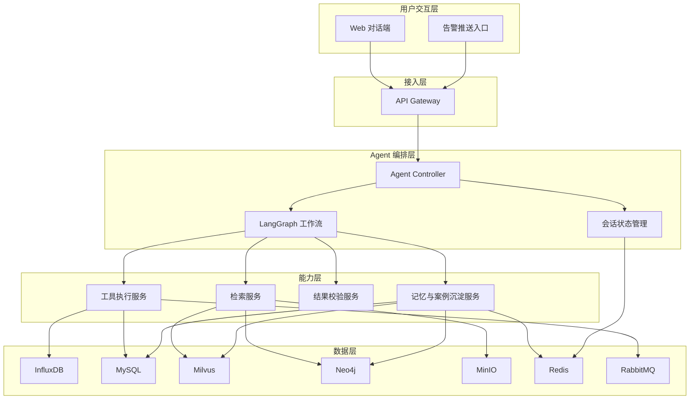
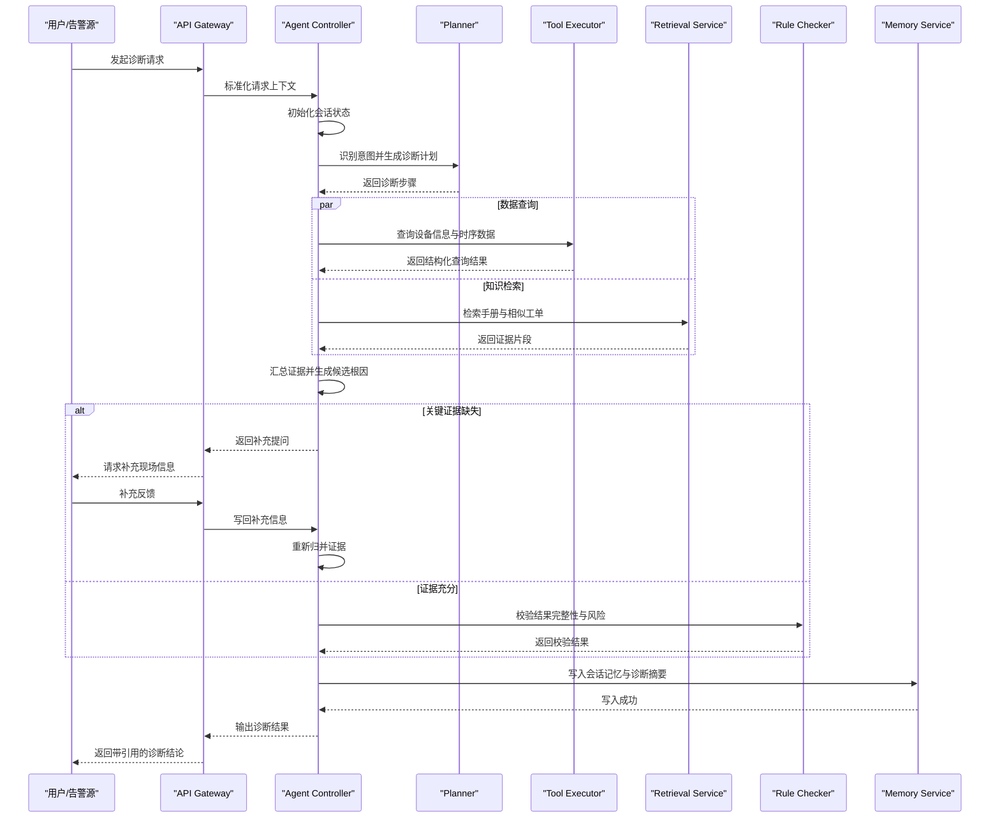
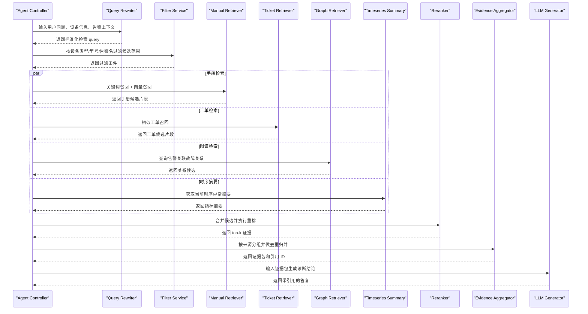
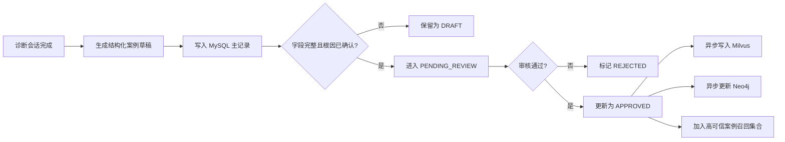

# 能源设备运维诊断 Agent — 详细设计方案

> 当前口径：本文前 13 章仍是业务功能和质量要求的源头；若本文中的模型、fallback、mock、可观测后端、验收方式或示例配置与最新实施冻结决定冲突，按
> [文档权威与冲突收敛说明](./文档权威与冲突收敛说明.md) 和
> [详细设计真实服务接入方案第 9 节](./详细设计真实服务接入方案.md)
> 裁决。

## 一、一期范围

一期聚焦“告警辅助诊断”主链路，目标是让 Agent 在收到设备告警后，能够：

1. 自动拉取相关设备信息、实时/近实时传感器数据和历史工单；
2. 联合检索设备手册、历史案例和结构化设备元数据；
3. 输出候选根因、证据引用、排查顺序和安全提示；
4. 在证据不足或结论风险较高时，主动请求人工补充信息或确认；
5. 将已闭环且审核通过的案例沉淀为后续可复用知识。

### 1.1 非目标

以下内容不作为一期硬目标：

1. 无人值守的全自动故障处置；
2. 完整覆盖所有设备类型和故障类型；
3. 多模态视觉缺陷识别全量落地；
4. 自主写回知识库且完全不经人工审核；
5. 跨公司、跨区域、跨设备体系的零配置迁移。

### 1.2 设计原则

1. **证据优先**：结论必须尽量绑定时序数据、文档片段、历史工单或人工确认信息；
2. **工作流优先**：先保证稳定的诊断链路，再逐步增加高级推理能力；
3. **人机协同**：Agent 负责加速定位与信息组织，最终处置决策由人工确认；
4. **渐进增强**：模板、规则和工具调用先落地，复杂自由推理逐步增强；
5. **可评估可追踪**：每次诊断都应保留输入、工具调用轨迹、证据引用和输出结果。

### 1.3 范围层级

本文列出的储能、光伏和风电场景共同构成一期的设计覆盖层，不要求首次试点同时上线全部场景：

1. 设计覆盖层保留全部设备类型、故障模板、工具和数据模型；
2. Mock 与离线评估层为各类场景保留代表性样例，验证架构的通用性；
3. 试点验收层由实施阶段 0 选择 1 到 2 类设备和 3 到 5 类告警；
4. 未进入首次试点的设计内容继续保留，可在试点阶段通过新增 Real Adapter 逐步启用。

---

## 二、业务场景与需求拆解

### 2.1 目标业务场景

一期优先覆盖以下高频场景：

1. 储能设备温度异常、风扇异常、电流异常等告警诊断；
2. 光伏逆变器离线、功率异常、通讯异常的辅助排查；
3. 风电关键部件告警后的手册定位与历史工单检索；
4. 运维值班人员通过对话方式快速了解“告警是什么、优先查什么、为什么这样查”。

### 2.2 目标用户

1. 一线运维工程师：希望快速获得排查顺序和依据；
2. 值班监控人员：需要在短时间内完成初步分诊；
3. 运维主管：关注重复问题沉淀和处理效率提升；
4. 领域专家：希望把经验转为结构化模板和案例知识。

### 2.3 典型输入

输入分为两类：

1. **事件驱动输入**
   - 告警 ID
   - 设备 ID
   - 场站 ID
   - 告警名称
   - 告警发生时间
2. **人工对话输入**
   - “这台 PCS 温度一直升高，先查什么？”
   - “帮我看一下这个设备最近是否有类似工单”
   - “为什么你判断是风扇故障而不是传感器漂移？”

### 2.4 典型输出

1. 诊断摘要；
2. 候选根因排序；
3. 每个根因的证据来源；
4. 建议的排查顺序；
5. 风险等级与安全提示；
6. 需要人工补充的关键信息；
7. 是否建议创建或升级工单。

### 2.5 核心功能需求

1. 支持通过告警入口自动触发诊断；
2. 支持对话式二次追问和补充上下文；
3. 支持多源异构数据查询与统一上下文编排；
4. 支持带引用的生成式答复；
5. 支持低置信度转人工；
6. 支持诊断结果与工单案例关联沉淀；
7. 支持全链路观测与评估。

### 2.6 非功能需求

1. 首轮诊断建议生成时间目标为 1 到 3 分钟；
2. 工具调用成功率目标不低于 95%；
3. 核心接口需具备超时、重试、熔断与降级机制；
4. 关键诊断结果需具备可追溯的证据链；
5. 关键操作需有权限控制和审计日志；
6. 在 LLM 不可用时，系统需退化为规则检索与模板输出。

---

## 三、总体技术架构

### 3.1 架构概览

系统分为五层：

1. **交互层**
   - Web 对话端
   - 告警推送入口
2. **接入层**
   - API Gateway
   - 鉴权、限流、会话初始化、流式响应
3. **Agent 编排层**
   - Agent Controller
   - LangGraph 工作流
   - 会话状态管理
4. **能力层**
   - 检索服务
   - 工具执行服务
   - 结果校验服务
   - 记忆与案例沉淀服务
5. **数据层**
   - InfluxDB
   - MySQL
   - Milvus
   - Neo4j
   - MinIO
   - Redis

总体架构图如下：



### 3.2 逻辑组件职责

| 组件 | 核心职责 | 输入 | 输出 |
|------|---------|------|------|
| API Gateway | 请求接入、鉴权、流式响应、路由 | 用户消息、告警事件 | 标准化请求上下文 |
| Agent Controller | 会话管理、状态机驱动、任务编排 | 标准化请求上下文 | 工作流状态与中间结果 |
| Planner Node | 生成诊断步骤和工具调用计划 | 当前状态、告警信息 | 诊断计划 |
| Tool Executor | 调用时序、设备、工单、检索工具 | 工具调用参数 | 结构化工具结果 |
| Evidence Aggregator | 汇总证据、生成候选原因 | 多工具结果 | 证据包 |
| Reflector | 校验结论完整性与一致性 | 证据包、草稿结论 | 校验结果 |
| Response Generator | 生成最终答复和可引用内容 | 校验后的证据包 | 用户可读结果 |
| Memory Service | 会话上下文保存、案例入库 | 会话中间态、闭环结果 | 短期/长期记忆 |

### 3.3 部署形态

采用容器化部署形态：

1. `gateway-service`
2. `agent-service`
3. `retrieval-service`
4. `tool-service`
5. `memory-service`
6. `evaluation-service`
7. 共享基础设施：Redis、MySQL、Milvus、Neo4j、InfluxDB、MinIO、RabbitMQ

一期实施时，可将 `retrieval-service`、`tool-service`、`memory-service` 合并为一个后端服务，以降低初期系统复杂度；随着调用量和模块边界逐步清晰，再按职责拆分为独立服务。

部署形态与逻辑服务采用并集关系：逻辑职责始终保留，物理进程按环境选择。

| 部署配置 | 物理形态 | 适用场景 |
|----------|----------|----------|
| 本地开发 | gateway、agent、retrieval、tool、memory 可合并 | 快速启动、单元测试和开发调试 |
| Mock 联调 | gateway 与 agent 独立，其余能力按团队边界合并 | 前后端联调和完整闭环演示 |
| 试点生产 | gateway、agent 独立；retrieval/tool、memory 可分别合并 | 控制运维复杂度并保留扩展边界 |
| 扩展生产 | 按原有逻辑组件拆分，并可启用 admin/evaluation 服务 | 高并发、多团队和独立扩缩容 |

完整数据层保留 InfluxDB、MySQL、Milvus、Neo4j、MinIO、Redis、RabbitMQ，以及 RAG 使用的 OpenSearch/Elasticsearch。组件是否独立部署由对应 Provider 和当前实施阶段决定，不部署的增强组件必须有明确降级路径。

---

## 四、核心工作流设计

### 4.1 工作流总体说明

一期使用 LangGraph 实现可控工作流，不将问题完全交给自由对话 Agent。整体流程如下：

1. 接收告警或人工提问；
2. 识别意图、设备、告警类型；
3. 生成诊断步骤；
4. 执行工具调用；
5. 汇总证据并生成候选原因；
6. 判断是否需要人工补充；
7. 生成带引用的排查建议；
8. 对结果做规则校验与风险标记；
9. 返回结果并写入会话记忆；
10. 在工单闭环后沉淀案例。

### 4.2 状态机设计

| 状态 | 说明 | 进入条件 | 退出条件 |
|------|------|---------|---------|
| `INIT` | 初始化会话与请求上下文 | 新请求进入 | 识别到有效意图 |
| `PLAN_READY` | 诊断计划已生成 | 完成意图识别和实体抽取 | 计划通过基础校验 |
| `DATA_FETCHING` | 正在执行工具查询 | 需要拉取数据或检索知识 | 所有必要工具执行完成 |
| `EVIDENCE_READY` | 证据已归集 | 数据与检索结果返回 | 证据满足最低要求 |
| `NEED_USER_INPUT` | 需要人工补充现场信息 | 关键证据缺失或冲突 | 用户提供补充信息 |
| `DRAFT_READY` | 已生成候选结论 | 证据可支持初步判断 | 进入校验阶段 |
| `REVIEWING` | 正在执行规则校验 | 草稿结论生成完成 | 校验通过或回退 |
| `COMPLETED` | 本轮诊断完成 | 结果已输出 | 会话结束或进入下一轮 |
| `FAILED` | 诊断失败或超时 | 异常不可恢复 | 人工接管 |

### 4.3 LangGraph 节点设计

| 节点名称 | 作用 | 输入 | 输出 |
|---------|------|------|------|
| `intent_router` | 识别意图与请求类型 | 用户输入、告警事件 | 意图标签 |
| `entity_parser` | 解析设备、场站、告警等实体 | 原始输入 | 标准化实体 |
| `plan_builder` | 构建诊断步骤 | 意图、实体、模板 | 计划对象 |
| `tool_dispatcher` | 生成结构化工具调用清单 | 计划对象 | 工具任务列表 |
| `timeseries_fetcher` | 查询时序指标 | 设备、时间窗、指标 | 时序查询结果 |
| `ticket_fetcher` | 查询历史工单 | 设备、故障关键词 | 工单结果 |
| `doc_retriever` | 检索手册和案例 | 检索问题、过滤条件 | 文档片段 |
| `evidence_aggregator` | 证据归并与排序 | 多工具结果 | 证据包 |
| `gap_detector` | 检测缺失信息 | 证据包 | 缺口列表 |
| `clarification_generator` | 生成追问问题 | 缺口列表 | 补充提问 |
| `reason_generator` | 生成候选根因 | 证据包 | 候选根因列表 |
| `response_generator` | 生成用户可读结果 | 候选根因、证据包 | 诊断答复 |
| `rule_checker` | 进行规则校验 | 诊断答复、证据包 | 校验结果 |
| `memory_writer` | 会话写入和案例沉淀 | 会话结果、人工确认信息 | 写入状态 |

### 4.4 路由规则

#### 4.4.1 意图路由

支持以下意图：

1. `fault_diagnosis`
2. `knowledge_qa`
3. `history_ticket_query`
4. `followup_clarification`

路由策略：

1. 告警事件默认进入 `fault_diagnosis`；
2. 包含设备编号、告警名称、故障描述的自然语言请求优先识别为 `fault_diagnosis`；
3. 包含“为什么”“依据是什么”的问题优先路由到已有会话上下文下的解释链路；
4. 无设备上下文且仅询问概念的请求走 `knowledge_qa`。

#### 4.4.2 故障类型路由

根据告警名称、设备类型、指标异常特征选择诊断模板，例如：

1. 温度异常模板；
2. 通讯异常模板；
3. 功率异常模板；
4. 风扇/散热链路异常模板；
5. 传感器异常模板。

### 4.5 主链路时序

```text
告警事件/用户输入
  -> API Gateway
  -> Agent Controller
  -> intent_router
  -> entity_parser
  -> plan_builder
  -> tool_dispatcher
  -> timeseries_fetcher / ticket_fetcher / doc_retriever
  -> evidence_aggregator
  -> gap_detector
  -> [需要补充信息 ? clarification_generator : reason_generator]
  -> response_generator
  -> rule_checker
  -> memory_writer
  -> 输出诊断结果
```

主诊断链路时序图如下：



### 4.6 人工确认节点

以下场景必须触发人工确认：

1. 候选根因之间差异较小，模型置信度不足；
2. 高风险处置建议涉及停机、断电、切换回路等操作；
3. 时序数据缺失、设备元数据缺失或关键工具调用失败；
4. 文档证据与历史工单结论明显冲突；
5. 现场状态无法从远程数据中判断。

### 4.7 降级策略

1. LLM 超时或不可用时，退化为“规则模板 + 检索结果列表 + 人工建议查看文档”；
2. 向量检索不可用时，仅保留结构化数据查询和关键词检索；
3. InfluxDB 查询失败时，明确提示时序数据不可用，不输出强结论；
4. Neo4j 不可用时，不影响主链路，只降低关联分析能力；
5. 任一关键工具连续失败超过阈值时，直接建议人工接管。

---

## 五、数据接入与知识库设计

代码工程实现以[详细设计真实服务接入方案第 9 节](./详细设计真实服务接入方案.md)和[外部接口确认单](./external_interface_checklist.md)为准。

### 5.1 数据源分类

| 数据源 | 类型 | 示例内容 | 用途 |
|------|------|---------|------|
| 设备手册 | 非结构化 | PDF、Word、维护指南 | 维修步骤、部件说明、告警解释 |
| 历史工单 | 半结构化 | 工单标题、现象、处理结果 | 相似案例召回 |
| 设备元数据 | 结构化 | 设备型号、投运时间、厂家 | 检索过滤、上下文补足 |
| 实时/近实时时序数据 | 时序 | 温度、电流、电压、转速 | 异常判断 |
| 告警事件流 | 事件 | 告警名称、时间、等级 | 触发诊断 |
| 专家规则/模板 | 结构化 | 排查步骤模板、阈值规则 | 规划与校验 |

### 5.2 文档处理流程

设备手册和运维文档进入知识库时采用以下预处理：

1. 文档上传至 MinIO；
2. 文档解析提取正文、目录、页码、章节标题；
3. 按“章节标题 + 语义块”切分，每块控制在 300 到 600 中文字；
4. 为每个 chunk 生成元数据：
   - `doc_id`
   - `device_type`
   - `device_model`
   - `chapter_title`
   - `page_no`
   - `source_type`
   - `version`
5. 写入 Milvus 向量索引；
6. 可选地将“告警-部件-处理步骤”关系抽取写入 Neo4j。

### 5.3 历史工单处理流程

历史工单入库时保留以下字段：

| 字段 | 说明 |
|------|------|
| `ticket_id` | 工单唯一标识 |
| `site_id` | 场站 ID |
| `device_id` | 设备 ID |
| `device_model` | 设备型号 |
| `alarm_name` | 触发告警 |
| `fault_symptom` | 故障现象描述 |
| `root_cause` | 根因结论 |
| `action_taken` | 处理动作 |
| `is_verified` | 是否人工确认闭环 |
| `close_time` | 关单时间 |
| `embedding_text` | 用于向量化的摘要文本 |

工单向量化采用结构化拼接文本：

```text
设备型号 + 告警名称 + 故障现象 + 根因 + 处理动作 + 关单备注
```

### 5.4 时序数据建模

InfluxDB 中按设备类型规划 measurement，例如：

1. `pcs_metrics`
2. `inverter_metrics`
3. `fan_metrics`
4. `environment_metrics`

通用 tag：

1. `site_id`
2. `device_id`
3. `device_model`
4. `metric_name`

通用 field：

1. `value`
2. `quality`
3. `status_code`

### 5.5 Neo4j 知识图谱建模

一期知识图谱不做过度复杂设计，优先服务于“故障关系补充”：

#### 节点类型

1. `DeviceType`
2. `Component`
3. `Alarm`
4. `FaultCause`
5. `Action`
6. `Case`

#### 边类型

1. `(:Alarm)-[:MAY_BE_CAUSED_BY]->(:FaultCause)`
2. `(:FaultCause)-[:RELATES_TO]->(:Component)`
3. `(:FaultCause)-[:MITIGATED_BY]->(:Action)`
4. `(:Case)-[:CONFIRMS]->(:FaultCause)`
5. `(:DeviceType)-[:HAS_ALARM]->(:Alarm)`

约束如下：

1. 图谱仅作为补充检索与关系组织，不作为单点事实来源；
2. 新案例写入图谱前需通过人工审核；
3. 图谱召回分值不直接等同于根因概率。

---

## 六、RAG 方案设计

### 6.1 检索目标

RAG 主要服务三个问题：

1. 当前告警通常如何解释；
2. 历史上相似问题是如何定位和处理的；
3. 设备手册推荐的标准检查步骤是什么。

### 6.2 RAG 技术组件

RAG 模块的核心技术组件如下：

| 组件 | 技术选型 | 作用 | 说明 |
|------|---------|------|------|
| 文档对象存储 | MinIO | 存储原始手册、运维文档 | 保存 PDF/Word 原件及版本 |
| 向量检索 | Milvus | 手册片段、工单案例的 dense retrieval | 承担语义召回主链路 |
| 关键词检索 | OpenSearch / Elasticsearch | 手册标题、告警词、工单文本的 lexical retrieval | 提升专业术语、型号词命中率 |
| 元数据过滤 | MySQL | 设备类型、型号、厂家、版本过滤 | 缩小候选范围 |
| 关系补充检索 | Neo4j | 告警、部件、故障原因关系查询 | 补充召回，不作为唯一事实来源 |
| Embedding 模型 | BGE-M3 | 中文语义向量化 | 支持中英混合、术语召回 |
| Reranker 模型 | BGE-Reranker-v2-M3 | 对候选片段重排 | 统一比较不同来源候选质量 |
| 生成模型 | Qwen2.5-72B | 基于证据包生成带引用答复 | 支持私有化部署，不直接读取原始长文档 |

选型说明：

1. 向量检索和关键词检索分开建设，避免纯 dense retrieval 对型号词、部件编号、告警代码不敏感；
2. Embedding 与 reranker 优先选择可私有化中文模型，便于在企业内网部署；
3. 元数据过滤不放到向量库内部做复杂逻辑，而是由检索服务统一编排，便于维护召回策略。

### 6.3 索引构建与数据预处理

RAG 质量高度依赖索引构建方式，一期按以下策略进行预处理：

#### 6.3.1 手册分块策略

1. 按“目录标题 -> 章节 -> 语义段落”三级结构切分；
2. 单 chunk 长度控制在 300 到 600 中文字；
3. chunk overlap 控制在 50 到 100 中文字，避免跨段落信息断裂；
4. 对表格、注意事项、告警列表单独切块，不与正文混合；
5. 对“步骤型内容”保留编号，避免生成时顺序丢失。

#### 6.3.2 手册元数据字段

每个 chunk 至少保留以下元数据：

| 字段 | 说明 |
|------|------|
| `doc_id` | 文档 ID |
| `device_type` | 设备类型 |
| `device_model` | 设备型号 |
| `manufacturer` | 厂家 |
| `chapter_title` | 章节标题 |
| `section_type` | 正文/表格/告警定义/维护步骤 |
| `page_no` | 页码 |
| `version` | 文档版本 |
| `keywords` | 抽取的设备与故障关键词 |

#### 6.3.3 工单案例预处理

1. 仅将已闭环、已审核工单进入高可信案例库；
2. 工单文本按“现象 + 根因 + 处理动作 + 备注”拼接成 `embedding_text`；
3. 对设备编号、部件名、告警名做标准化映射；
4. 删除无信息量模板语句，例如“已处理”“恢复正常”等；
5. 保留工单时间，用于后续 freshness 打分。

#### 6.3.4 索引更新策略

1. 手册类文档按版本全量更新，同型号保留多版本索引；
2. 工单类文档按天或按批次增量更新；
3. 新增案例先写 MySQL，再异步写入 Milvus 和关键词索引；
4. 索引更新任务通过 RabbitMQ 异步解耦；
5. 版本切换时保留旧索引一段时间，支持灰度回滚。

### 6.4 检索策略

采用“元数据过滤 + 关键词召回 + 向量召回 + 重排”的混合检索策略，执行顺序如下：

1. 根据 `device_type`、`device_model`、`alarm_name`、`manufacturer` 进行首轮过滤；
2. 分别对手册库和工单库执行关键词召回，召回标题命中、告警词命中和故障术语命中结果；
3. 使用改写后的 query 执行向量召回，获取语义相似候选；
4. 对关键词结果与向量结果进行 merge；
5. 调用 reranker 统一重排后输出 top-k；
6. 将 top-k 候选送入证据归并模块生成最终证据包。

默认参数建议：

| 参数 | 手册检索 | 工单检索 |
|------|---------|---------|
| keyword recall topN | 20 | 20 |
| vector recall topN | 20 | 20 |
| rerank input size | 30 | 30 |
| final topK | 5 | 5 |
| similarity threshold | 0.45 | 0.50 |

参数说明：

1. 手册类内容更偏知识说明，阈值可略低以提高覆盖率；
2. 工单类内容噪声更大，阈值略高以控制错误类比；
3. `final topK` 不宜过大，否则会显著增加生成上下文噪声。

### 6.5 查询重写

为了提高召回效果，在 `doc_retriever` 之前引入查询重写。查询重写不只改写一条 query，而是生成多路检索表达。

实现方式采用“规则标准化 + LLM 轻量改写”的两阶段方案，而不是完全依赖自由生成：

1. **第一阶段：规则标准化**
   - 基于设备字典、告警字典、部件别名字典做实体归一化；
   - 将用户输入中的设备简称、口语表述、历史别名映射为标准术语；
   - 提取结构化字段，如 `device_type`、`device_model`、`alarm_name`、`component`、`symptom_terms`；
2. **第二阶段：LLM 轻量改写**
   - 调用私有化部署的 Qwen2.5-72B 推理服务；
   - 输入第一阶段抽取出的结构化字段和原始问题；
   - 输出多路检索 query，而不是直接输出最终诊断结论；
3. **降级策略**
   - 当 LLM 改写服务超时或不可用时，仅使用规则标准化结果拼接检索 query；
   - 保证查询重写失败不会阻断 RAG 主链路。

查询重写服务不直接暴露给前端，而是作为检索服务内部子模块实现。调用方式可以是：

1. `retrieval-service` 进程内函数调用；
2. 独立的内部 RPC 服务；
3. 通过统一模型网关调用私有化 LLM 推理接口。

若查询重写通过统一模型网关调用 Qwen，则必须适用第 8.7 节定义的模型网关协议、鉴权、超时、降级、成本记录和审计规则。若阶段 3 暂时保留独立 `qwen_rewrite_endpoint`，该形态仅作为过渡实现，需在配置和联调记录中标注，后续收敛到统一模型网关，避免查询重写调用游离于统一治理之外。

查询重写输出结构如下：

```json
{
  "normalized_alarm_name": "PCS机柜温度持续升高",
  "device_type": "PCS",
  "device_model": "SC5000",
  "component": "散热风扇",
  "manual_query": "PCS 机柜温度持续升高可能原因及排查步骤",
  "ticket_query": "同型号 PCS 温度告警 风扇失效 滤网堵塞 工单案例",
  "graph_query": "PCS 温度告警 散热风扇 故障原因",
  "keyword_terms": ["PCS", "温度告警", "散热", "风扇", "滤网"]
}
```

1. `manual_query`：用于设备手册与说明类文档；
2. `ticket_query`：用于历史工单与案例检索；
3. `graph_query`：用于图谱关系补充；
4. `keyword_terms`：用于关键词召回和过滤扩展。

查询重写规则如下：

1. 从用户自然语言中提取标准化告警名；
2. 将口语现象转换为运维专业表达；
3. 将非标准部件别名映射为统一术语；
4. 将模糊表达补齐为“设备 + 现象 + 场景”的检索句；
5. 对时序异常类问题补充指标词，如温度、电流、风扇转速、环境温度。

LLM 改写 Prompt 目标如下：

1. 只做检索表达改写，不输出诊断结论；
2. 优先保留设备型号、告警名、部件名等高价值关键词；
3. 避免生成未经输入提供的新设备信息；
4. 输出必须满足 JSON Schema，便于下游检索模块直接消费。

推荐的实现约束如下：

1. 查询重写模型 temperature 设为 0 到 0.3，减少发散；
2. 单次改写最大输出长度控制在 256 tokens 以内；
3. 改写结果通过 schema 校验，字段缺失时回退到规则拼接；
4. 对高频告警类型可直接走模板改写，减少 LLM 调用成本。

示例：

| 输入 | 输出 |
|------|------|
| `这台储能柜为什么一直报警温度高` | `manual_query=PCS 机柜温度持续升高可能原因及排查步骤` |
| `这台储能柜为什么一直报警温度高` | `ticket_query=同型号 PCS 温度告警 风扇失效 滤网堵塞 工单案例` |
| `这台储能柜为什么一直报警温度高` | `keyword_terms=[PCS, 温度告警, 散热, 风扇, 滤网]` |

### 6.6 RAG 检索时序

RAG 主链路的执行时序如下：



时序说明：

1. 查询重写负责把用户自然语言转换为更稳定的检索表达；
2. 结构化过滤先缩小候选集，再分别执行手册、工单、图谱和时序摘要获取；
3. 重排阶段统一比较不同来源的候选证据，避免单一路径召回结果主导最终判断；
4. 证据归并阶段负责去重、分组和生成引用 ID，供后续生成模块直接使用；
5. 最终生成阶段仅消费已经归并好的证据包，不直接读取原始长文档。

### 6.7 RAG 上下文组织

为避免上下文窗口污染，检索结果按来源分组：

1. `manual_evidence`
2. `ticket_evidence`
3. `timeseries_summary`
4. `device_metadata`
5. `graph_relations`

生成时不直接塞入全部原文，而是先做摘要归并与裁剪：

1. 提取文档核心句；
2. 去重相同含义片段；
3. 标记证据来源 ID；
4. 对长段落执行压缩摘要，保留结论句和步骤句；
5. 仅传递与当前告警强相关的片段。

建议的上下文拼装顺序如下：

1. `device_metadata`
2. `timeseries_summary`
3. `manual_evidence`
4. `ticket_evidence`
5. `graph_relations`

上下文预算控制如下：

| 上下文块 | 建议条数 | 说明 |
|---------|---------|------|
| `device_metadata` | 1 | 保留结构化设备上下文 |
| `timeseries_summary` | 1 | 保留最近时间窗摘要 |
| `manual_evidence` | 2 到 3 | 优先放标准步骤和告警解释 |
| `ticket_evidence` | 1 到 2 | 仅放高可信相似案例 |
| `graph_relations` | 1 到 2 | 作为补充关系提示 |

约束：

1. 总上下文长度优先控制在生成模型安全窗口的 30% 到 40%；
2. 不把多个相似结论的重复文本同时塞入上下文；
3. 对未验证工单只传摘要结论，不传过长原文。

### 6.8 证据评分与重排

证据评分与重排模块负责解决两个问题：

1. 多路召回结果混合后，如何统一排序；
2. 如何避免低质量工单、重复片段或弱相关图谱关系污染最终上下文。

实现上采用“两段式排序”：

1. **第一段：召回侧初筛**
   - 各检索通道先基于自身分数做 topN 截断；
   - 去除明显低于阈值的候选；
   - 对相同 `source_id + chunk_id` 的重复结果做合并；
2. **第二段：统一重排**
   - 将手册、工单、图谱、时序摘要映射为统一候选结构；
   - 调用 reranker 模型计算语义相关性；
   - 结合规则分数计算 `final_score`；
   - 按分数排序后生成最终 topK 证据列表。

候选证据统一结构如下：

```json
{
  "source_type": "manual",
  "source_id": "MANUAL-PCS-017",
  "chunk_id": "chunk_0032",
  "content": "若机柜温度持续升高，应优先检查散热风扇运行状态和滤网堵塞情况。",
  "metadata": {
    "device_type": "PCS",
    "device_model": "SC5000",
    "chapter_title": "散热系统维护",
    "verified": true,
    "publish_time": "2025-01-10"
  },
  "raw_scores": {
    "keyword_score": 0.82,
    "vector_score": 0.77,
    "rerank_score": 0.00
  }
}
```

每条证据包含如下分值：

| 分值字段 | 说明 |
|---------|------|
| `retrieval_score` | 检索匹配度 |
| `source_reliability` | 来源可靠性，手册高于未验证工单 |
| `freshness_score` | 时间新鲜度，近期工单可适度加权 |
| `verification_score` | 是否经过人工闭环确认 |
| `relevance_to_alarm` | 与当前告警模板的相关程度 |

#### 6.8.1 检索分数归一化

不同检索通道返回的原始分数不可直接比较，因此需要统一归一化：

1. `keyword_score`：来自 BM25 或 OpenSearch 打分，使用 min-max 或 sigmoid 归一化到 0 到 1；
2. `vector_score`：来自 Milvus 相似度，统一转换为 0 到 1；
3. `rerank_score`：来自 reranker 模型，直接归一到 0 到 1；
4. `timeseries_match_score`：当时序摘要与候选原因高度一致时，附加规则奖励分；
5. `graph_support_score`：图谱关系仅作为补充分，不直接主导排序。

建议的合成方式：

```text
retrieval_score =
0.30 * keyword_score +
0.40 * vector_score +
0.30 * rerank_score
```

说明：

1. reranker 在第二段排序中权重较高，但不应完全覆盖关键词和向量召回结果；
2. 对告警代码、设备型号、部件编号等强关键词命中场景，可适当提高 `keyword_score` 权重；
3. 对自然语言现象描述较强的问题，可适当提高 `vector_score` 与 `rerank_score` 权重。

#### 6.8.2 来源可靠性打分

`source_reliability` 由来源类型和数据质量共同决定，默认可按如下规则初始化：

| 来源 | 默认分值 |
|------|---------|
| 官方设备手册 | 1.00 |
| 审核通过的标准运维文档 | 0.95 |
| 已闭环且已审核工单 | 0.85 |
| 已闭环但未审核工单 | 0.65 |
| 图谱关系结果 | 0.60 |
| 临时知识或低质量文本 | 0.40 |

此外还可叠加修正项：

1. 文档版本过旧时，降低 0.05 到 0.15；
2. 工单来源于同型号设备时，提高 0.05；
3. 工单仅现象相似、设备差异较大时，降低 0.10；
4. 图谱边若来自多个已审核案例支撑，可提高 0.05 到 0.10。

#### 6.8.3 新鲜度与验证度打分

`freshness_score` 主要用于工单和案例类证据：

1. 近 3 个月工单：1.00；
2. 3 到 6 个月：0.85；
3. 6 到 12 个月：0.70；
4. 12 个月以上：0.50。

`verification_score` 主要体现是否经过人工闭环确认：

1. 已审核闭环：1.00；
2. 已闭环未审核：0.70；
3. 未闭环或状态不明：0.30。

#### 6.8.4 告警相关性打分

`relevance_to_alarm` 由以下条件综合判断：

1. 告警名称是否完全一致；
2. 设备型号是否完全一致；
3. 部件是否一致；
4. 现象描述是否匹配当前时序摘要；
5. 检索片段是否包含当前模板关注的关键步骤或原因。

推荐规则：

1. 告警名称完全一致且设备型号一致：基础分 0.90 以上；
2. 告警名称相近但设备型号不同：基础分 0.70 左右；
3. 仅现象相似、缺少设备和告警锚点：不高于 0.50；
4. 若时序摘要与证据描述明显冲突，则直接降到 0.20 以下。

最终重排分数可采用加权方式计算：

```text
final_score =
0.35 * retrieval_score +
0.20 * source_reliability +
0.15 * verification_score +
0.15 * relevance_to_alarm +
0.15 * freshness_score
```

#### 6.8.5 重排执行流程

统一重排的工程流程如下：

1. 对每一路候选结果附加标准化 metadata；
2. 计算 `keyword_score`、`vector_score` 与 `rerank_score`；
3. 根据来源类型计算 `source_reliability`；
4. 根据工单时间计算 `freshness_score`；
5. 根据审核状态计算 `verification_score`；
6. 根据告警、设备、部件匹配情况计算 `relevance_to_alarm`；
7. 合成 `final_score` 并排序；
8. 对排序结果执行去重和多样性约束；
9. 输出最终 topK 到证据归并模块。

重排策略：

1. 手册和已审核工单默认权重高于未审核工单；
2. 同分情况下，优先保留标准手册步骤类片段；
3. 若两个候选来自同一来源且语义重复，仅保留分数更高者；
4. 图谱关系结果默认不直接进入 top1，必须与手册或工单证据交叉验证。

#### 6.8.6 去重与多样性控制

如果只按分数排序，最终 topK 可能全部来自同一份手册或同一批历史工单，因此需要增加去重与多样性约束：

1. 同一 `doc_id` 的 chunk 最多保留 2 条；
2. 同一 `ticket_id` 最多保留 1 条；
3. 图谱关系结果最多保留 1 到 2 条；
4. 如果 topK 全部来自单一来源，则强制插入至少 1 条其他高相关来源证据；
5. 对内容相似度高于阈值的文本做语义去重。

推荐的语义去重方式：

1. 先按 `source_id` 去重；
2. 再对文本计算 embedding cosine similarity；
3. 相似度高于 0.92 时视为重复；
4. 保留 `final_score` 更高者。

#### 6.8.7 参数配置与可调优设计

证据评分模块应设计为可配置，而不是把权重写死在代码中。建议配置项包括：

```yaml
retrieval:
  keyword_topn: 20
  vector_topn: 20
  rerank_topn: 30
  final_topk: 5
weights:
  retrieval_score: 0.35
  source_reliability: 0.20
  verification_score: 0.15
  relevance_to_alarm: 0.15
  freshness_score: 0.15
dedup:
  max_chunks_per_doc: 2
  max_tickets_per_case: 1
  semantic_similarity_threshold: 0.92
threshold:
  manual_similarity: 0.45
  ticket_similarity: 0.50
```

这些配置建议放入：

1. 检索服务配置文件；
2. 数据库中的策略配置表；
3. 后台运营配置中心。

#### 6.8.8 降级与异常处理

1. reranker 不可用时，使用 `keyword_score + vector_score + source_reliability` 做简化排序；
2. 部分候选缺失时间信息时，`freshness_score` 使用默认中位值 0.60；
3. 部分候选缺失审核状态时，`verification_score` 使用保守值 0.30；
4. 若全部候选 `final_score` 低于最低阈值，则不进入生成强结论链路，只输出“召回依据不足”；
5. 对明显冲突的证据集合，直接打上 `need_manual_confirmation=true` 标记。

#### 6.8.9 输出结构

重排模块输出建议采用如下结构：

```json
{
  "ranked_evidence": [
    {
      "source_type": "manual",
      "source_id": "MANUAL-PCS-017",
      "chunk_id": "chunk_0032",
      "final_score": 0.89,
      "retrieval_score": 0.84,
      "source_reliability": 1.00,
      "verification_score": 1.00,
      "freshness_score": 0.80,
      "relevance_to_alarm": 0.92,
      "need_manual_confirmation": false
    }
  ]
}
```

该结构直接供 `evidence_aggregator` 使用，避免在生成阶段重新计算分数。

### 6.9 引用策略与降级规则

最终答复中引用格式采用：

```text
[手册: MANUAL-PCS-017 第 3.2 节]
[工单: TICKET-20250132]
[时序: device=PCS-10086, window=last_30m]
```

引用策略要求：

1. 每个关键结论至少有一条可追溯证据；
2. 高风险建议至少需要两类独立证据支持；
3. 仅凭模型常识不能输出“已确认根因”。

降级规则：

1. 向量检索超时或失败时，保留关键词召回结果并显式标记“语义召回降级”；
2. reranker 不可用时，按 `retrieval_score + source_reliability` 做规则排序；
3. 图谱检索失败时，不影响主链路，只移除关系补充结果；
4. 手册和工单均未召回有效结果时，仅输出时序事实和人工补查建议；
5. 任一路径召回结果少于阈值时，不强行拼接低相关文本填充上下文。

---

## 七、Tool Use 设计

### 7.1 工具设计原则

1. 工具入参必须结构化；
2. 工具返回值必须标准化 JSON；
3. 每个工具都要定义超时、重试和错误码；
4. 工具只做一件事，避免职责过大；
5. 工具调用必须记录审计日志。

#### 7.1.1 企业级工具设计约束

为适配真实企业应用场景，所有工具设计额外遵循以下约束：

1. 所有工具默认携带统一 `context` 上下文：
   - `tenant_id`
   - `org_id`
   - `site_id`
   - `trace_id`
   - `operator_id`
   - `source_system`
2. 工具分为三类：
   - `READ_ONLY`：只读查询类
   - `WRITE_CONTROLLED`：受工作流和权限控制的写入类
   - `REVIEW_GATED`：必须经过人工审核或显式确认的高风险写入类
3. 模型不直接决定高风险写入状态，后端服务根据权限、工作流状态和审核结果执行业务落库；
4. 搜索类工具必须支持过滤、阈值、条数上限和已审核数据开关；
5. 所有工具应区分“无结果”“部分结果”“失败”三种状态；
6. 所有工具出参必须支持审计字段和来源系统标记。

### 7.2 核心工具清单

| 工具名 | 类型 | 风险级别 | 作用 | 关键入参 | 关键出参 |
|------|------|---------|------|---------|---------|
| `get_device_profile` | `READ_ONLY` | 低 | 查询设备基础信息 | `context`, `device_id` | 型号、厂家、投运时间、设备状态 |
| `get_alarm_detail` | `READ_ONLY` | 低 | 查询告警详情 | `context`, `alarm_id` | 告警名称、级别、时间、原始告警摘要 |
| `query_timeseries_window` | `READ_ONLY` | 中 | 查询时序窗口 | `context`, `device_id`, `metrics`, `start`, `end` | 时序摘要、统计值、异常点、数据完整性 |
| `search_manual_chunks` | `READ_ONLY` | 低 | 检索手册片段 | `context`, `query`, `filters`, `top_k` | 文档片段列表、版本、页码、命中分数 |
| `search_similar_tickets` | `READ_ONLY` | 中 | 检索相似工单 | `context`, `query`, `filters`, `verified_only` | 相似工单列表、审核状态、相似度 |
| `query_graph_relations` | `READ_ONLY` | 中 | 查询知识图谱关系 | `context`, `alarm_name`, `component` | 关联故障、部件、处理动作、关系强度 |
| `create_or_update_ticket` | `WRITE_CONTROLLED` | 高 | 创建/更新工单 | `context`, `action`, `device_id`, `summary` | 工单编号、状态、是否提交成功 |
| `append_case_review` | `REVIEW_GATED` | 高 | 写入人工审核结果 | `context`, `session_id`, `review_result` | 审核回写状态、案例状态、操作时间 |

### 7.3 工具 Schema 示例

#### 7.3.1 时序查询工具

```json
{
  "name": "query_timeseries_window",
  "description": "Query recent timeseries metrics for a device",
  "parameters": {
    "type": "object",
    "properties": {
      "context": {
        "type": "object",
        "properties": {
          "tenant_id": { "type": "string" },
          "org_id": { "type": "string" },
          "site_id": { "type": "string" },
          "trace_id": { "type": "string" },
          "operator_id": { "type": "string" },
          "source_system": { "type": "string" }
        },
        "required": ["trace_id", "source_system"]
      },
      "device_id": { "type": "string" },
      "metrics": {
        "type": "array",
        "items": { "type": "string" }
      },
      "start_time": { "type": "string", "description": "ISO8601" },
      "end_time": { "type": "string", "description": "ISO8601" },
      "aggregation": {
        "type": "string",
        "enum": ["raw", "avg", "max", "min", "trend"]
      },
      "granularity": {
        "type": "string",
        "enum": ["1m", "5m", "15m", "1h"],
        "default": "5m"
      },
      "max_points": {
        "type": "integer",
        "minimum": 1,
        "maximum": 5000,
        "default": 500
      }
    },
    "required": ["context", "device_id", "metrics", "start_time", "end_time"]
  }
}
```

#### 7.3.2 手册检索工具

```json
{
  "name": "search_manual_chunks",
  "description": "Search relevant manual chunks for current diagnosis task",
  "parameters": {
    "type": "object",
    "properties": {
      "context": {
        "type": "object",
        "properties": {
          "tenant_id": { "type": "string" },
          "org_id": { "type": "string" },
          "site_id": { "type": "string" },
          "trace_id": { "type": "string" },
          "operator_id": { "type": "string" },
          "source_system": { "type": "string" }
        },
        "required": ["trace_id", "source_system"]
      },
      "query": { "type": "string" },
      "filters": {
        "type": "object",
        "properties": {
          "device_type": { "type": "string" },
          "device_model": { "type": "string" },
          "manufacturer": { "type": "string" },
          "alarm_name": { "type": "string" },
          "doc_version": { "type": "string" },
          "section_type": {
            "type": "array",
            "items": {
              "type": "string",
              "enum": ["正文", "表格", "告警定义", "维护步骤", "注意事项"]
            }
          },
          "effective_only": {
            "type": "boolean",
            "default": true
          }
        }
      },
      "retrieval_mode": {
        "type": "string",
        "enum": ["hybrid", "keyword_only", "vector_only"],
        "default": "hybrid"
      },
      "score_threshold": {
        "type": "number",
        "minimum": 0,
        "maximum": 1,
        "default": 0.45
      },
      "top_k": { "type": "integer", "default": 5 }
    },
    "required": ["context", "query"]
  }
}
```

#### 7.3.3 设备画像查询工具

```json
{
  "name": "get_device_profile",
  "description": "Get standardized device profile for diagnosis context building",
  "parameters": {
    "type": "object",
    "properties": {
      "context": {
        "type": "object",
        "properties": {
          "tenant_id": { "type": "string" },
          "org_id": { "type": "string" },
          "site_id": { "type": "string" },
          "trace_id": { "type": "string" },
          "operator_id": { "type": "string" },
          "source_system": { "type": "string" }
        },
        "required": ["trace_id", "source_system"]
      },
      "device_id": { "type": "string" },
      "include_fields": {
        "type": "array",
        "items": {
          "type": "string",
          "enum": [
            "device_type",
            "device_model",
            "manufacturer",
            "commission_time",
            "location",
            "status",
            "rated_power"
          ]
        }
      }
    },
    "required": ["context", "device_id"]
  }
}
```

#### 7.3.4 告警详情查询工具

```json
{
  "name": "get_alarm_detail",
  "description": "Get alarm detail by alarm id for diagnosis initialization",
  "parameters": {
    "type": "object",
    "properties": {
      "context": {
        "type": "object",
        "properties": {
          "tenant_id": { "type": "string" },
          "org_id": { "type": "string" },
          "site_id": { "type": "string" },
          "trace_id": { "type": "string" },
          "operator_id": { "type": "string" },
          "source_system": { "type": "string" }
        },
        "required": ["trace_id", "source_system"]
      },
      "alarm_id": { "type": "string" },
      "device_id": { "type": "string" },
      "include_raw_payload": {
        "type": "boolean",
        "default": false
      }
    },
    "required": ["context", "alarm_id"]
  }
}
```

#### 7.3.5 相似工单检索工具

```json
{
  "name": "search_similar_tickets",
  "description": "Search similar historical tickets for current device and alarm context",
  "parameters": {
    "type": "object",
    "properties": {
      "context": {
        "type": "object",
        "properties": {
          "tenant_id": { "type": "string" },
          "org_id": { "type": "string" },
          "site_id": { "type": "string" },
          "trace_id": { "type": "string" },
          "operator_id": { "type": "string" },
          "source_system": { "type": "string" }
        },
        "required": ["trace_id", "source_system"]
      },
      "query": { "type": "string" },
      "filters": {
        "type": "object",
        "properties": {
          "device_type": { "type": "string" },
          "device_model": { "type": "string" },
          "alarm_name": { "type": "string" },
          "manufacturer": { "type": "string" },
          "site_id": { "type": "string" },
          "exclude_ticket_ids": {
            "type": "array",
            "items": { "type": "string" }
          }
        }
      },
      "top_k": { "type": "integer", "default": 5 },
      "verified_only": { "type": "boolean", "default": true },
      "time_range_months": { "type": "integer", "default": 12 },
      "score_threshold": {
        "type": "number",
        "minimum": 0,
        "maximum": 1,
        "default": 0.5
      }
    },
    "required": ["context", "query"]
  }
}
```

#### 7.3.6 图谱关系查询工具

```json
{
  "name": "query_graph_relations",
  "description": "Query graph relations between alarm, component, fault cause and mitigation actions",
  "parameters": {
    "type": "object",
    "properties": {
      "context": {
        "type": "object",
        "properties": {
          "tenant_id": { "type": "string" },
          "org_id": { "type": "string" },
          "site_id": { "type": "string" },
          "trace_id": { "type": "string" },
          "operator_id": { "type": "string" },
          "source_system": { "type": "string" }
        },
        "required": ["trace_id", "source_system"]
      },
      "alarm_name": { "type": "string" },
      "device_type": { "type": "string" },
      "component": { "type": "string" },
      "relation_depth": {
        "type": "integer",
        "minimum": 1,
        "maximum": 3,
        "default": 2
      },
      "top_k": { "type": "integer", "default": 5 }
    },
    "required": ["context", "alarm_name"]
  }
}
```

#### 7.3.7 工单创建或更新工具

```json
{
  "name": "create_or_update_ticket",
  "description": "Create or update maintenance ticket after explicit confirmation or workflow approval",
  "parameters": {
    "type": "object",
    "properties": {
      "context": {
        "type": "object",
        "properties": {
          "tenant_id": { "type": "string" },
          "org_id": { "type": "string" },
          "site_id": { "type": "string" },
          "trace_id": { "type": "string" },
          "operator_id": { "type": "string" },
          "source_system": { "type": "string" }
        },
        "required": ["trace_id", "operator_id", "source_system"]
      },
      "action": {
        "type": "string",
        "enum": ["create", "update"]
      },
      "session_id": { "type": "string" },
      "device_id": { "type": "string" },
      "site_id": { "type": "string" },
      "ticket_id": { "type": "string" },
      "summary": { "type": "string" },
      "priority": {
        "type": "string",
        "enum": ["low", "medium", "high", "critical"]
      },
      "root_cause": { "type": "string" },
      "resolution_steps": {
        "type": "array",
        "items": { "type": "string" }
      },
      "safety_notes": {
        "type": "array",
        "items": { "type": "string" }
      },
      "evidence_refs": {
        "type": "array",
        "items": { "type": "string" }
      },
      "workflow_guard": {
        "type": "object",
        "properties": {
          "confirmation_token": { "type": "string" },
          "approved_by_rule_checker": { "type": "boolean" }
        }
      }
    },
    "required": ["context", "action", "device_id", "summary", "priority"]
  }
}
```

#### 7.3.8 人工审核结果回写工具

```json
{
  "name": "append_case_review",
  "description": "Append human review result for diagnosis session and case draft",
  "parameters": {
    "type": "object",
    "properties": {
      "context": {
        "type": "object",
        "properties": {
          "tenant_id": { "type": "string" },
          "org_id": { "type": "string" },
          "site_id": { "type": "string" },
          "trace_id": { "type": "string" },
          "operator_id": { "type": "string" },
          "source_system": { "type": "string" }
        },
        "required": ["trace_id", "operator_id", "source_system"]
      },
      "session_id": { "type": "string" },
      "review_result": {
        "type": "string",
        "enum": ["confirmed", "rejected", "needs_more_info"]
      },
      "reviewer": { "type": "string" },
      "root_cause": { "type": "string" },
      "comments": { "type": "string" },
      "evidence_refs": {
        "type": "array",
        "items": { "type": "string" }
      },
      "review_comment": { "type": "string" }
    },
    "required": ["context", "session_id", "review_result", "reviewer"]
  }
}
```

### 7.4 工具返回值规范

所有工具统一返回：

```json
{
  "success": true,
  "status": "SUCCESS",
  "data": {},
  "meta": {
    "trace_id": "xxx",
    "source_system": "ems",
    "partial_result": false,
    "latency_ms": 128
  },
  "error_code": "",
  "error_message": "",
  "warnings": []
}
```

约束：

1. `status` 取值建议为 `SUCCESS`、`PARTIAL_SUCCESS`、`NOT_FOUND`、`FAILED`；
2. `success=false` 时必须带 `error_code`；
3. 对于不可恢复错误，Agent 不应重复调用超过设定次数；
4. 所有工具返回都要携带 `trace_id` 便于链路追踪；
5. 搜索类工具返回中应显式标注 `partial_result`，避免误把降级结果当成完整结果。

#### 7.4.1 ToolResult 超集与兼容规则

研发补充说明中的紧凑返回结构和本文的企业级返回结构共同受支持。所有边界返回先归一化为内部 `ToolResult`，再交给 Agent：

```json
{
  "success": true,
  "status": "OK",
  "data": {},
  "meta": {
    "trace_id": "trace_abc",
    "source_system": "ems",
    "provider_type": "real",
    "partial_result": false,
    "latency_ms": 128
  },
  "error_code": "",
  "error_message": "",
  "warnings": []
}
```

兼容规则：

1. `SUCCESS` 与 `OK` 都表示成功；进入内部状态前统一为 `OK`；
2. 状态全集为 `OK/SUCCESS`、`PARTIAL_SUCCESS`、`NOT_FOUND`、`TIMEOUT`、`DEGRADED`、`FAILED`；
3. 旧结构顶层的 `trace_id`、`source` 继续接受，并映射到 `meta.trace_id`、`meta.provider_type`；
4. `source` 表示请求来源时映射为 `request_source`，表示 Mock/Real 时映射为 `provider_type`，EMS/CMDB 等真实来源统一进入 `source_system`；
5. `alarm_time` 与 `trigger_time` 互为兼容别名，内部统一保留带时区的 ISO8601 时间；
6. `start/end` 与 `start_time/end_time` 互为兼容别名，内部统一为 `start_time/end_time`；
7. `error_code/error_message` 继续作为稳定字段，后续如增加嵌套 `error` 对象必须双向映射。

### 7.5 工具调用控制

1. 单轮最大工具调用数不超过 8 次；
2. 同类工具连续失败两次后停止重试；
3. 工具参数必须经过 schema 校验；
4. 高风险工具如工单写入类默认不自动执行，需要用户确认；
5. 工具调用权限应基于角色控制。

### 7.6 工具能力成熟度

1. `query_graph_relations` 的接口、Mock 数据和降级行为属于基础能力；Neo4j 真实接入和关系治理属于增强能力；
2. `create_or_update_ticket` 在基础阶段可生成草稿或待确认请求，真实写入必须满足权限、幂等、审计和显式确认；
3. `append_case_review` 属于审核闭环基础能力，索引和图谱的异步回写可按组件可用性分别完成；
4. 工具是否使用 Mock 或 Real Provider 不改变 Tool Schema 和 Agent 工作流。

---

## 八、Prompt 与生成策略

### 8.1 Prompt 分层

Prompt 拆分为三层：

1. **系统层 Prompt**
   - 定义角色、边界、输出风格、禁忌事项；
2. **节点层 Prompt**
   - 针对 `plan_builder`、`reason_generator`、`clarification_generator` 等节点分别设计；
3. **任务层 Prompt**
   - 将当前设备、告警、时序摘要、文档证据、工单证据注入。

### 8.2 系统层 Prompt 核心约束

1. 不允许凭空编造设备状态或维修结论；
2. 不允许把未验证工单当作确定事实；
3. 如果证据不足，必须明确说明不确定性；
4. 高风险建议必须加人工确认提示；
5. 输出必须结构化，便于前端渲染和日志分析。

### 8.3 `plan_builder` Prompt 目标

目标：

1. 根据告警类型选择最少必要诊断步骤；
2. 优先使用稳定模板；
3. 仅在必要时增加补充步骤；
4. 为每一步生成预期工具和判断目标。

输出格式：

```json
{
  "diagnosis_plan": [
    {
      "step_id": "S1",
      "goal": "确认温度异常是否持续存在",
      "tool": "query_timeseries_window",
      "required": true
    }
  ]
}
```

### 8.4 `reason_generator` Prompt 目标

目标：

1. 依据证据生成 2 到 4 个候选根因；
2. 按概率或可信度排序；
3. 为每个根因提供支持证据和反证信息；
4. 标记是否需要现场确认。

输出格式：

```json
{
  "candidate_causes": [
    {
      "cause": "风扇失效",
      "confidence": 0.78,
      "supporting_evidence": ["TICKET-1", "MANUAL-3.2", "TS-30M"],
      "missing_information": ["现场是否有异常噪音"],
      "need_manual_confirmation": true
    }
  ]
}
```

### 8.5 `response_generator` 输出模板

输出建议统一包含：

1. 诊断结论摘要；
2. 候选根因与排序；
3. 证据依据；
4. 建议排查步骤；
5. 风险提示；
6. 仍需补充的信息；
7. 是否建议创建工单。

### 8.6 Prompt 防幻觉策略

1. 明确要求只基于提供的证据回答；
2. 对“不确定”输出设置合法出口；
3. 使用结构化输入减少歧义；
4. 在生成前先做证据摘要归并；
5. 在生成后由规则校验器检查是否存在无引用结论。

### 8.7 模型网关接入设计

模型网关接入作为阶段 4 的新增并行子任务，服务于 Agent 主链路生成节点。它不替代阶段 4 原有的 Mock 主链路回归和已就绪 Real Adapter 联调任务。前端不直连模型，`agent-service` 负责调用统一模型网关，并将模型流式输出转换为现有诊断 SSE/WebSocket 事件。

#### 8.7.1 协议与鉴权

模型网关默认采用 OpenAI-compatible HTTP API：

```text
POST /v1/chat/completions
```

基础约束：

1. 非流式调用使用普通 JSON 响应；
2. 流式调用设置 `stream=true`，模型网关返回 SSE delta 分片；
3. `agent-service` 消费模型 SSE 后，转换为诊断事件，不把原始模型 SSE 直接暴露给前端；
4. 鉴权使用 `Authorization: Bearer <MODEL_GATEWAY_API_KEY>`；
5. 内部链路必须携带 `X-Trace-Id`、`X-Session-Id`、`X-Prompt-Version`；
6. 模型与上游错误统一映射到真实服务接入方案第 9.8.2 节的错误信封，并按第 9.17 节记录模型 attempt 与结算状态，不在本文另建错误码体系。

#### 8.7.2 请求 Schema

请求字段遵循 OpenAI-compatible chat completions 结构，并在 `metadata` 中携带诊断上下文：

```json
{
  "model": "qwen2.5-72b",
  "messages": [
    {
      "role": "system",
      "content": "系统层 Prompt"
    },
    {
      "role": "user",
      "content": "节点层和任务层输入"
    }
  ],
  "temperature": 0.2,
  "max_tokens": 1024,
  "stream": true,
  "response_format": {
    "type": "json_object"
  },
  "metadata": {
    "trace_id": "trace_001",
    "session_id": "diag_s_001",
    "node_name": "reason_generator",
    "prompt_version": "diag.reason_generator.v1.0",
    "site_id": "SITE-01",
    "device_type": "PCS",
    "evidence_package_id": "evpkg_001"
  }
}
```

约束：

1. `messages` 只注入证据包、设备上下文、告警上下文和用户补充信息，不注入未裁剪原始长文档；
2. `response_format.type` 默认使用 `json_object`，节点输出必须通过 JSON Schema 校验；
3. `temperature` 默认控制在 0 到 0.3；
4. `max_tokens` 按节点配置，超出预算时先裁剪弱证据和重复证据；
5. `metadata` 至少包含 `trace_id`、`session_id`、`node_name`、`prompt_version` 和 `evidence_package_id`。

#### 8.7.3 响应 Schema

非流式响应返回结构化 JSON 内容，并携带 usage 信息：

```json
{
  "id": "chatcmpl_diag_001",
  "model": "qwen2.5-72b",
  "model_provider": "model-gateway-primary",
  "choices": [
    {
      "index": 0,
      "message": {
        "role": "assistant",
        "content": "{\"candidate_causes\":[]}"
      },
      "finish_reason": "stop"
    }
  ],
  "usage": {
    "prompt_tokens": 1200,
    "completion_tokens": 240,
    "total_tokens": 1440
  }
}
```

流式响应使用 SSE delta 分片，最终事件携带 `usage`、`finish_reason` 和 `model_provider`。`agent-service` 只将可展示的阶段性内容转换为诊断流式事件，并在最终完成后写入结构化结果。

#### 8.7.4 节点分工与 Prompt 版本

生成类节点与模型网关的关系如下：

| 节点 | 模型输出 | Prompt 版本示例 | 降级方式 |
|------|----------|-----------------|----------|
| `reason_generator` | 候选根因 JSON | `diag.reason_generator.v1.0` | 使用规则模板和证据摘要生成候选根因草稿 |
| `response_generator` | 用户可读诊断答复 JSON | `diag.response_generator.v1.0` | 输出“规则模板 + 证据摘要 + 人工确认提示” |
| `clarification_generator` | 补充问题 JSON | `diag.clarification_generator.v1.0` | 使用预置缺口问题模板，不阻断 NEED_USER_INPUT 分支 |

Prompt 版本命名采用 `diag.<node>.<major>.<minor>`。每次模型调用必须记录节点名、Prompt 版本、模型名、供应商、输入输出 token、错误码和 trace_id。`rule_checker` 不依赖模型自由判断，继续负责 schema 校验、引用校验、风险提示和高风险动作拦截。

#### 8.7.5 重试、限流与降级

重试规则：

1. 仅对超时、HTTP 429、HTTP 5xx 做有限重试；
2. 默认最多重试 1 到 2 次，单次超时由 `model_gateway.timeout_seconds` 控制；
3. 高风险写入类动作不因模型重试自动触发；
4. 非法 JSON、schema 校验失败和 evidence_id 引用不存在不重试，直接降级并进入 `rule_checker` 失败路径或模板输出。

限流规则：

1. 按用户、场站、会话、模型供应商四级限流；
2. 限流状态可复用 Redis `diag:rate_limit:{user_id}` 并扩展维度；
3. 触发限流时记录 `LLM_RATE_LIMITED`，返回模板降级结果和可重试提示；
4. 限流不应影响查询已有诊断结果和人工确认提交。

降级规则：

1. 模型不可用时记录 `LLM_UNAVAILABLE`；
2. 模型超时时记录 `LLM_TIMEOUT`；
3. 模型限流时记录 `LLM_RATE_LIMITED`；
4. 模型返回非法 JSON、缺字段或不符合节点输出 Schema 时记录 `LLM_INVALID_RESPONSE`；
5. 降级输出必须显式标记不确定性，并保留证据引用和人工确认提示。

#### 8.7.6 成本控制与审计

成本控制策略：

1. 限制单轮证据条数和上下文 token，优先保留强证据、同型号证据和近期证据；
2. 限制单节点 `max_tokens` 和单会话模型调用次数；
3. 配置每日 token 预算，超预算后优先降级 `response_generator` 的自然语言润色，保留结构化证据和候选根因；
4. 对高频告警优先使用模板，减少重复模型调用；
5. 记录 `prompt_tokens`、`completion_tokens`、`total_tokens` 和 `estimated_cost`。

审计字段至少包括：

1. `trace_id`
2. `session_id`
3. `node_name`
4. `prompt_version`
5. `model_provider`
6. `model_name`
7. `finish_reason`
8. `error_code`
9. `usage`
10. `estimated_cost`

#### 8.7.7 供应商切换与配置

模型网关配置作为全局配置中的独立块，与业务数据源 `providers` 并列：

```yaml
providers:
  device_profile: mock
  alarm: mock
  timeseries: mock
  manual_search: mock
  ticket_search: mock
  graph_relation: mock

model_gateway:
  provider: model-gateway-primary
  model_name: qwen2.5-72b
  endpoint: https://model-gateway.example.com/v1/chat/completions
  api_key_ref: MODEL_GATEWAY_API_KEY
  timeout_seconds: 30
  max_retries: 2
  rate_limit_policy: default
  daily_token_budget: 1000000
  fallback_enabled: true
```

`providers` 继续管理设备、告警、时序、手册、工单、图谱等业务数据源的 Mock/Real 切换；`model_gateway` 只管理模型供应商和推理网关，不混入 Provider Registry。供应商差异由模型网关适配层处理，Agent 节点只依赖统一请求、响应和错误语义。

#### 8.7.8 契约测试场景

阶段 4 需要补充以下模型网关契约测试和演练记录：

1. 正常非流式生成；
2. 正常 SSE 流式生成；
3. `clarification_generator` 模型不可用时输出模板问题；
4. 模型超时后模板降级；
5. HTTP 429 限流后降级并记录统一错误码；
6. 返回 JSON 不合法时拒绝结果并回退；
7. 模型输出不存在的 evidence_id 时由 `rule_checker` 拦截；
8. 查询重写走统一模型网关时适用同一鉴权、限流、成本和降级规则；
9. 切换模型供应商后 Agent 工作流和前端诊断事件协议不变。

---

## 九、记忆与案例沉淀设计

### 9.1 短期记忆

短期记忆存储在 Redis 中，Key 设计如下：

```text
diag:session:{session_id}
```

短期记忆的目标不是“长期学习”，而是支撑单次诊断会话中的上下文连续性、节点协同和人工补充信息回写。它主要解决以下问题：

1. 多轮对话中设备、告警、时序窗口等上下文不丢失；
2. 避免同一轮中重复调用相同工具；
3. 在补充提问后能继续沿用之前的证据和候选根因；
4. 支撑前端刷新、断线重连和流式响应恢复。

#### 9.1.1 短期记忆对象结构

建议会话对象采用结构化 JSON 存储，内容包括：

1. 当前设备与场站信息；
2. 当前告警与时间窗；
3. 已执行工具和结果摘要；
4. 已生成候选根因；
5. 用户补充信息；
6. 当前状态机状态；
7. 当前轮次的证据引用与风险标记；
8. 待人工补充问题列表；
9. 最近一次生成结果的摘要。

示例结构：

```json
{
  "session_id": "diag_s_001",
  "status": "EVIDENCE_READY",
  "device_context": {
    "site_id": "SITE-01",
    "device_id": "PCS-10086",
    "device_type": "PCS",
    "device_model": "SC5000"
  },
  "alarm_context": {
    "alarm_id": "ALARM-20260501-001",
    "alarm_name": "PCS机柜温度持续升高",
    "trigger_time": "2026-05-07T10:20:00+08:00"
  },
  "time_window": {
    "start_time": "2026-05-07T09:50:00+08:00",
    "end_time": "2026-05-07T10:20:00+08:00"
  },
  "tool_cache": {
    "query_timeseries_window": {
      "executed": true,
      "result_ref": "ts_cache_001"
    }
  },
  "candidate_causes": [
    {
      "cause": "散热风扇失效",
      "confidence": 0.78,
      "need_manual_confirmation": true
    }
  ],
  "clarification_questions": [
    "现场是否存在异常噪音",
    "风扇是否正常转动"
  ],
  "user_feedback": [
    {
      "question": "风扇是否正常转动",
      "answer": "现场确认风扇不转"
    }
  ],
  "evidence_refs": [
    "MANUAL-PCS-017#chunk_0032",
    "TICKET-20250132",
    "TS-PCS-10086-30M"
  ]
}
```

#### 9.1.2 Redis Key 设计

建议拆分多类 Key，避免所有数据都堆在一个对象中：

1. `diag:session:{session_id}`：主会话上下文；
2. `diag:tool-cache:{session_id}`：工具调用缓存；
3. `diag:clarify:{session_id}`：待补充问题与用户回答；
4. `diag:stream:{session_id}`：最近一次流式输出片段；
5. `diag:lock:{session_id}`：会话级写锁；
6. `diag:device-lock:{device_id}`：同设备并发诊断控制。

#### 9.1.3 读写时机

短期记忆在以下时机写入：

1. 创建会话时写入基础设备与告警上下文；
2. 每次工具调用成功后写入工具结果摘要与引用；
3. 每次生成候选根因后写入诊断中间态；
4. 进入 `NEED_USER_INPUT` 状态时写入待补充问题；
5. 用户补充现场信息后回写答案和更新时间；
6. 会话完成时写入最终摘要与风险标记。

短期记忆在以下时机读取：

1. 用户继续追问时恢复历史上下文；
2. Agent 节点切换时读取前序结果；
3. 前端刷新页面时恢复当前诊断状态；
4. 工具重试前判断是否已有可复用缓存；
5. 流式输出中断后恢复最后状态。

#### 9.1.4 TTL 与清理策略

1. 活跃会话 TTL 建议设置为 24 小时；
2. 已完成会话缓存 TTL 建议设置为 72 小时；
3. 高风险或需复核会话可延长到 7 天；
4. 工具缓存可使用更短 TTL，如 2 到 6 小时；
5. 超时未继续的会话由定时任务归档并删除 Redis 数据。

#### 9.1.5 并发控制与一致性

1. 同一 `session_id` 的写操作通过 Redis 分布式锁控制；
2. 同一 `device_id` 在短时间内重复告警时，优先复用已有会话或合并处理；
3. 对短期记忆更新采用版本号或 `updated_at` 校验，避免旧结果覆盖新结果；
4. 流式生成过程中禁止并发写入最终结论字段；
5. 工具结果缓存只存摘要和引用，不存超大原始 payload。

### 9.2 长期记忆分层设计

长期记忆不等于“模型自动学习”，而是由结构化案例库、向量案例索引和关系知识库共同组成：

1. **结构化案例库（MySQL）**
   - 存储审核后的标准案例主记录；
   - 作为案例的事实主库；
2. **向量案例索引（Milvus）**
   - 存储案例摘要向量和检索元数据；
   - 用于相似案例召回；
3. **关系知识库（Neo4j）**
   - 存储告警、部件、根因、处理动作之间的关系；
   - 用于补充关联分析；
4. **原始附件存储（MinIO）**
   - 存储工单附件、截图、补充说明文档等。

### 9.3 长期案例库设计

长期案例库用于后续相似问题召回，核心字段如下：

| 字段 | 说明 |
|------|------|
| `case_id` | 案例 ID |
| `source_session_id` | 来源会话 |
| `source_ticket_id` | 来源工单 ID |
| `device_type` | 设备类型 |
| `device_model` | 设备型号 |
| `manufacturer` | 厂家 |
| `alarm_name` | 告警名称 |
| `symptom_summary` | 现象摘要 |
| `timeseries_features` | 关键时序特征摘要 |
| `root_cause` | 最终根因 |
| `resolution_steps` | 处理步骤 |
| `safety_notes` | 安全提示 |
| `evidence_refs` | 证据引用 |
| `review_status` | 审核状态 |
| `reviewer` | 审核人 |
| `review_comment` | 审核意见 |
| `case_version` | 案例版本 |
| `embedding_text` | 向量化文本 |
| `is_active` | 是否生效 |
| `created_at` | 创建时间 |
| `updated_at` | 更新时间 |

#### 9.3.1 案例状态机

案例建议定义显式状态，避免“写进去就默认可用”：

| 状态 | 说明 |
|------|------|
| `DRAFT` | 会话结束后自动生成的草稿案例 |
| `PENDING_REVIEW` | 待运维专家审核 |
| `APPROVED` | 审核通过，可进入强证据集 |
| `REJECTED` | 审核拒绝，不参与召回 |
| `DISABLED` | 历史案例失效，不再参与强召回 |
| `SUPERSEDED` | 被新版本案例替代 |

状态流转规则：

1. 会话完成并收到工单闭环结果后，生成 `DRAFT`；
2. 满足最小信息要求后进入 `PENDING_REVIEW`；
3. 审核通过后变为 `APPROVED`；
4. 审核拒绝则标记为 `REJECTED` 并记录原因；
5. 老版本案例被更新时，旧版本转为 `SUPERSEDED`。

### 9.4 案例沉淀流程

案例入库采用“主记录先落库，索引异步更新”的方式，流程如下：

1. 会话完成后生成结构化诊断摘要；
2. 若用户或工单系统返回“已确认根因”，生成案例草稿；
3. 将草稿写入 MySQL，状态置为 `DRAFT`；
4. 自动校验字段完整性，完整则进入 `PENDING_REVIEW`；
5. 运维专家或指定角色审核通过后更新主记录；
6. 异步更新 Milvus 向量索引；
7. 按需更新 Neo4j 关系节点与边；
8. 记录版本号、操作人和写入时间，支持回滚与审计。

Mermaid 流程如下：



#### 9.4.1 入库前最小字段校验

案例只有满足以下最小条件才允许进入审核流：

1. 存在明确 `device_type` 和 `device_model`；
2. 存在明确 `alarm_name` 或标准化告警标签；
3. 存在可读的 `symptom_summary`；
4. 存在人工确认的 `root_cause`；
5. 至少有一条有效 `evidence_refs`；
6. 存在基本可执行的 `resolution_steps`。

#### 9.4.2 向量化文本构造

案例向量化不直接使用整条工单原文，而是使用归一化后的摘要文本：

```text
设备类型 + 设备型号 + 告警名称 + 现象摘要 + 时序特征摘要 + 根因 + 处理步骤
```

这样可以降低噪声，提高相似案例召回的一致性。

#### 9.4.3 异步索引回写顺序

1. MySQL 主记录写入成功后，发送 `case_approved` 事件；
2. 索引任务消费事件，先写 Milvus；
3. Milvus 成功后再写 Neo4j；
4. 任一步失败时记录补偿任务；
5. 只有 MySQL 主记录状态为 `APPROVED` 时，才允许进入高可信召回集合。

### 9.5 记忆读取与使用策略

#### 9.5.1 短期记忆使用策略

1. 当前会话优先使用 Redis 中的中间态，不重复执行相同工具；
2. 用户追问“为什么这样判断”时，优先读取上一轮 `evidence_refs` 与候选根因；
3. 若用户补充了新现场信息，旧结论需重新标记版本，不直接覆盖；
4. 会话中新增的人工确认信息优先级高于先前模型推断。

#### 9.5.2 长期案例使用策略

1. 仅 `APPROVED` 状态案例可作为强证据；
2. `PENDING_REVIEW` 或 `DRAFT` 只能作为弱参考，不直接进入默认 topK；
3. 相似案例的排序仍需服从当前时序事实和告警相关性；
4. 同型号、同告警的案例优先级高于跨型号相似案例；
5. 已被 `DISABLED` 或 `SUPERSEDED` 的案例默认不参与主检索链路。

### 9.6 记忆回写风控

记忆与案例沉淀是高风险环节，必须避免把错误结论写回系统形成“错误自增强”：

1. 未经人工确认的根因不得直接写入长期案例库；
2. 模型生成的结论必须有证据引用才能形成案例草稿；
3. 对存在冲突证据或多候选未收敛的会话，只保留会话摘要，不进入案例审核流；
4. 案例审核操作必须记录审核人、审核意见和时间；
5. 被拒绝案例不得再次自动提交，需人工重新触发。

### 9.7 失败补偿与回滚

1. MySQL 成功但 Milvus 失败时，主记录状态保持 `APPROVED`，但 `index_status` 标记为 `PENDING_RETRY`；
2. Milvus 成功但 Neo4j 失败时，不影响主案例召回，仅影响关系补充能力；
3. 若发现案例内容错误，可将案例标记为 `DISABLED`，并触发索引下线任务；
4. 新版本案例发布后，旧版本可转 `SUPERSEDED`，保留历史追踪；
5. 所有补偿任务进入专门队列表，支持人工重试。

### 9.8 记忆使用边界

1. 未审核案例不能作为强证据；
2. 会话记忆仅作用于当前或关联会话，不应污染其他设备诊断；
3. 相似案例只能提供参考，不应直接覆盖当前时序事实；
4. 案例库要保留来源信息，支持追踪；
5. 长期案例库不是训练语料自动回写池，而是受审核控制的业务知识库。

---

## 十、接口设计

### 10.1 对外接口概览

#### 10.1.1 创建诊断会话

`POST /api/v1/diagnosis/sessions`

请求示例：

```json
{
  "source": "alarm",
  "alarm_id": "ALARM-20260501-001",
  "device_id": "PCS-10086",
  "site_id": "SITE-01"
}
```

响应示例：

```json
{
  "session_id": "diag_s_001",
  "status": "INIT"
}
```

#### 10.1.2 发起对话诊断

`POST /api/v1/diagnosis/chat`

请求示例：

```json
{
  "session_id": "diag_s_001",
  "message": "这台 PCS 温度持续升高，帮我分析下优先查什么"
}
```

#### 10.1.3 查询诊断结果

`GET /api/v1/diagnosis/sessions/{session_id}`

响应包含：

1. 当前状态；
2. 诊断结论；
3. 证据引用；
4. 工具调用摘要；
5. 待人工补充项。

#### 10.1.4 提交人工确认

`POST /api/v1/diagnosis/sessions/{session_id}/review`

请求示例：

```json
{
  "review_result": "confirmed",
  "root_cause": "风扇失效",
  "comments": "现场确认风扇不转"
}
```

#### 10.1.5 兼容会话消息接口

除 `POST /api/v1/diagnosis/chat` 外，同时支持：

`POST /api/v1/diagnosis/sessions/{session_id}/messages`

两者进入同一个会话消息处理器：`/chat` 适合作为便捷入口并从请求体读取 `session_id`，会话路径适合 REST 风格客户端并从路径读取 `session_id`。两者的鉴权、幂等、状态机和返回结构保持一致。

### 10.2 内部服务接口

内部接口拆分如下：

1. `POST /internal/tools/timeseries/query`
2. `POST /internal/tools/manual/search`
3. `POST /internal/tools/tickets/search`
4. `POST /internal/memory/session/save`
5. `POST /internal/cases/upsert`

### 10.3 流式响应设计

前端交互采用 SSE 或 WebSocket 推送阶段性结果：

1. `intent_identified`
2. `data_fetch_started`
3. `retrieval_completed`
4. `need_user_input`
5. `draft_generated`
6. `completed`

设计目标：

1. 提升等待过程中的可感知性；
2. 展示 Agent 的分阶段执行过程，而非仅展示最终答案；
3. 为人工补充信息、状态切换和异常回退提供更清晰的前端承载方式。

默认使用 SSE 推送单向诊断进度和结果；需要双向实时控制、长连接复用或客户端主动事件时启用 WebSocket。两种传输方式复用相同事件名称和 payload Schema，不形成两套业务协议。

---

## 十一、数据表与存储结构设计

### 11.1 MySQL 表设计

#### 11.1.1 `diagnosis_session`

| 字段 | 类型 | 说明 |
|------|------|------|
| `id` | varchar | 会话 ID |
| `source` | varchar | 来源：alarm/chat |
| `site_id` | varchar | 场站 ID |
| `device_id` | varchar | 设备 ID |
| `alarm_id` | varchar | 告警 ID |
| `alarm_name` | varchar | 告警名 |
| `status` | varchar | 当前状态 |
| `final_summary` | text | 结果摘要 |
| `risk_level` | varchar | 风险等级 |
| `created_at` | datetime | 创建时间 |
| `updated_at` | datetime | 更新时间 |

#### 11.1.2 `diagnosis_step_log`

| 字段 | 类型 | 说明 |
|------|------|------|
| `id` | bigint | 主键 |
| `session_id` | varchar | 会话 ID |
| `step_name` | varchar | 节点名 |
| `step_status` | varchar | 成功/失败 |
| `input_snapshot` | json | 输入快照 |
| `output_snapshot` | json | 输出快照 |
| `started_at` | datetime | 开始时间 |
| `ended_at` | datetime | 结束时间 |

#### 11.1.3 `diagnosis_case`

| 字段 | 类型 | 说明 |
|------|------|------|
| `case_id` | varchar | 案例 ID |
| `session_id` | varchar | 来源会话 |
| `device_type` | varchar | 设备类型 |
| `device_model` | varchar | 设备型号 |
| `alarm_name` | varchar | 告警名 |
| `root_cause` | varchar | 根因 |
| `resolution_steps` | text | 处理步骤 |
| `evidence_refs` | json | 引用列表 |
| `review_status` | varchar | 审核状态 |
| `created_at` | datetime | 创建时间 |

### 11.2 Redis 结构设计

1. `diag:session:{session_id}`：会话上下文；
2. `diag:lock:{device_id}`：同设备并发锁；
3. `diag:clarify:{session_id}`：待补充问题列表；
4. `diag:rate_limit:{user_id}`：限流状态。

### 11.3 Milvus Collection 设计

1. `manual_chunks`
2. `ticket_cases`
3. `expert_templates`

通用元数据字段：

1. `source_id`
2. `device_type`
3. `device_model`
4. `alarm_name`
5. `verified`
6. `version`

---

## 十二、可靠性、风控与安全设计

### 12.1 可靠性设计

1. 对外接口设置超时与幂等控制；
2. 工具调用设置重试上限；
3. 对 InfluxDB、Milvus 等依赖增加熔断与健康检查；
4. 对同一设备短时间重复告警做会话合并或去重；
5. 关键步骤持久化，支持断点恢复。

### 12.2 Guardrail 设计

Guardrail 分为四层：

1. **输入层**
   - 参数校验
   - 敏感命令过滤
   - 非法设备 ID 拦截
2. **规划层**
   - 工具白名单
   - 最大步骤数限制
   - 高风险工具禁自动调用
3. **生成层**
   - 必须引用证据
   - 禁止输出确认性语言当证据不足
   - 风险结论强制加人工确认标识
4. **输出层**
   - 正则/规则扫描敏感内容
   - 结果完整性检查
   - 关键字段不能为空

### 12.3 权限控制

角色划分如下：

1. `viewer`：查看诊断结果；
2. `operator`：发起诊断、补充现场信息；
3. `reviewer`：确认根因、审核案例入库；
4. `admin`：管理模板、规则、权限与系统配置。

### 12.4 审计设计

需要记录以下审计日志：

1. 谁发起了诊断；
2. 调用了哪些工具；
3. 生成了哪些高风险建议；
4. 谁确认了最终根因；
5. 哪些案例被写入或更新。

---

## 十三、可观测性与评估设计

### 13.1 可观测性

借助 LangSmith 或 LangFuse 记录：

1. 每轮会话输入输出；
2. LangGraph 节点耗时；
3. 工具调用参数与结果；
4. Prompt 版本；
5. 错误码和失败原因；
6. 用户补充信息与人工确认记录。

可观测接口对 LangSmith 和 LangFuse 保持适配能力：本地或 SaaS 环境可使用 LangSmith，私有化试点可使用 LangFuse；两者输出统一的 trace、节点、工具、Prompt 版本和错误字段。

### 13.2 关键监控指标

#### 业务指标

1. 首轮诊断完成时长；
2. 低置信度转人工率；
3. 工单创建建议采纳率；
4. 相似案例命中率；
5. 人工确认后的根因准确率。

#### 技术指标

1. LLM 平均响应时长；
2. 各工具成功率与平均耗时；
3. 向量检索命中率；
4. 会话失败率；
5. 各节点 token 消耗。

### 13.3 离线评估集设计

构建小规模高质量评估集，样本来源于历史闭环工单：

1. 每条样本包含告警、设备、时序摘要、根因、处理结果；
2. 按设备类型和故障类型分层采样；
3. 区分已验证工单与噪声工单；
4. 定期回归评估不同 Prompt、检索策略和工具编排版本。

### 13.4 评估指标定义

| 指标 | 说明 |
|------|------|
| Top-1 根因命中率 | 第一候选根因与人工确认是否一致 |
| Top-3 根因命中率 | 前三候选是否包含正确根因 |
| Evidence Coverage | 关键结论是否都有关联证据 |
| Tool Success Rate | 工具调用成功率 |
| Human Escalation Precision | 真正需要人工确认的样本是否被正确拦截 |

指标集合取四份文档并集：除上述指标外，同时保留完整诊断时长、会话失败率、无引用强结论数、高风险建议人工确认覆盖率和人工介入率。已有阈值继续有效；Top-1/Top-3 根因命中率、Human Escalation Precision 和人工介入率的试点目标由实施阶段 0 与业务方书面确认，不在技术设计中擅自补值。

---

## 十四、后续迭代方向

1. 引入多模态能力，支持设备照片、热成像图辅助判断；
2. 引入更细粒度的时序异常检测模型，为 Agent 提供结构化异常摘要；
3. 将经验图谱从静态关系扩展到设备部件级因果关系；
4. 增加维修工单自动草稿生成；
5. 建立 Prompt、模板、检索策略的版本化 A/B 实验机制。
